---

title: "【Free】使用Hugo搭建GitHub私人博客"
slug: "【Free】使用Hugo搭建GitHub私人博客"
description: 
date: "2024-10-18T22:19:18"
#lastmod: "2024-10-18T22:19:18"
image: hugo-stack.png
math: 
license: 
hidden: false
draft: false 
categories: ["日常折腾"]
tags: ["blog"]
---

## 环境准备

### Git下载
- 进入【[git官网](https://git-scm.com/downloads)】，找到对应适用于自己电脑系统的版本进行下载

  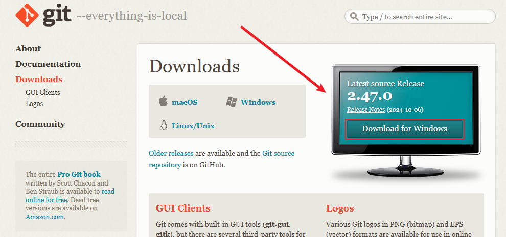

- 根据提示，默认安装即可

### Hugo下载
- 在【[Hugo的GitHub官网](https://github.com/gohugoio/hugo/releases)】上，根据自己系统，选择对应版本直接下载
（Tips：这里我根据【[Hugo官网](https://gohugo.io/installation/windows/)】的建议是安装了扩展版本）

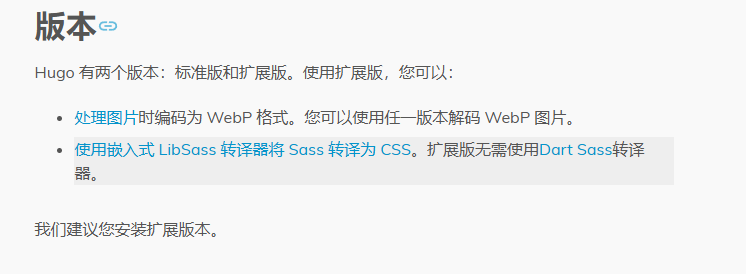

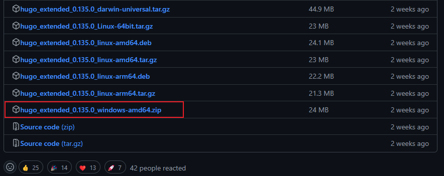

- 下载后解压即可

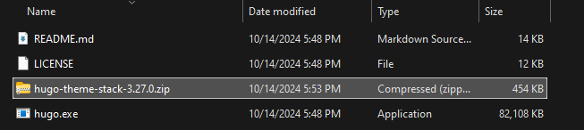

- （建议）将`hugo.exe`所在文件夹加入用户环境变量，方便使用`hugo`命令

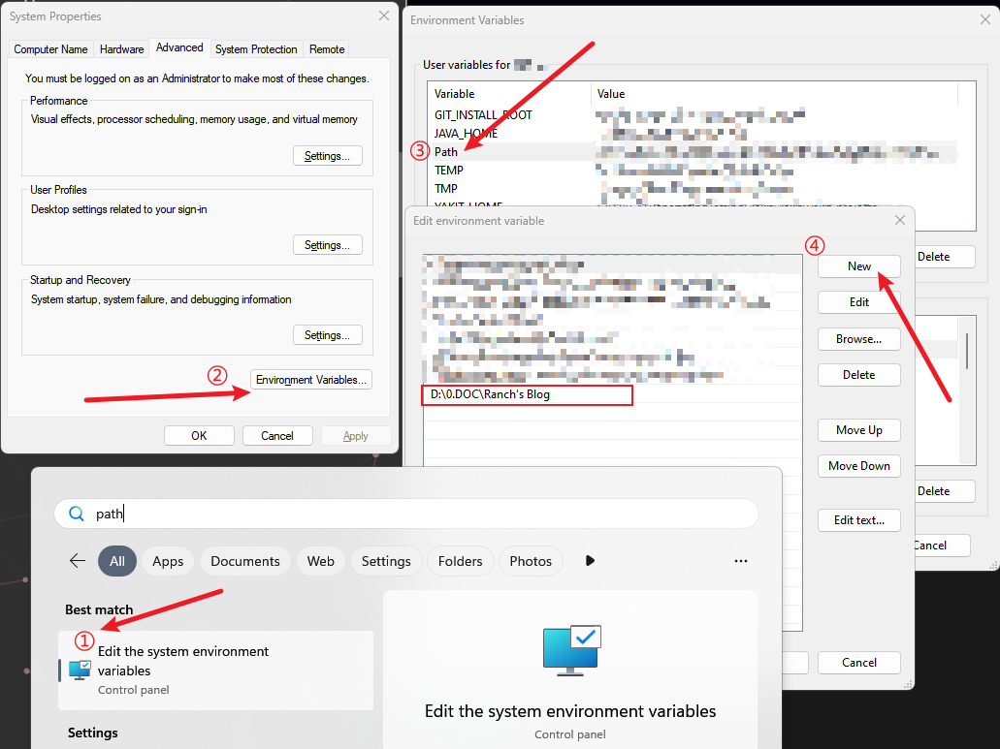

## 博客搭建

### 创建博客
- （1）在`hugo.exe`所在文件夹上方地址栏中，输入`cmd`，然后回车唤起命令行

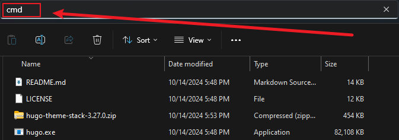

- （2）输入以下命令，创建xxx文件夹（这个文件夹就是博客的主文件夹，后面也可以改名）；并给出搭建博客的步骤

``````cmd
# 在当前文件夹中为创建xxx博客项目
hugo new site xxx
``````

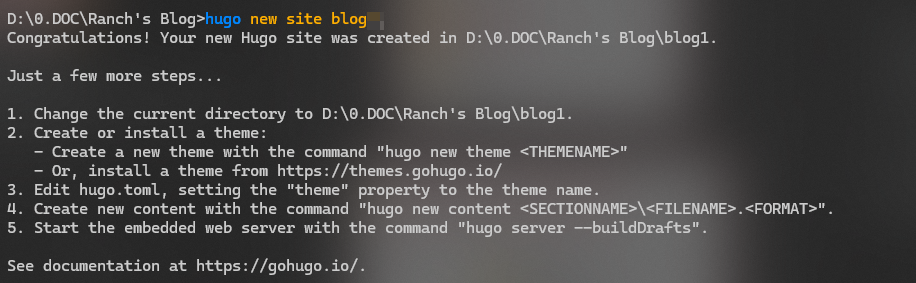

运行后便会输出一个网站目录，其结构为（引用自[炸鸡人博客](https://zhajiman.github.io/post/rebuild_blog)）：

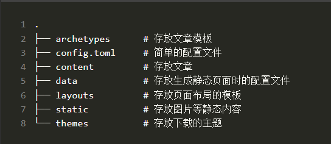

- `cd`切换进入`blog\`目录，输入下面命令，启动`hugo`服务

```cmd
hugo server -D
```

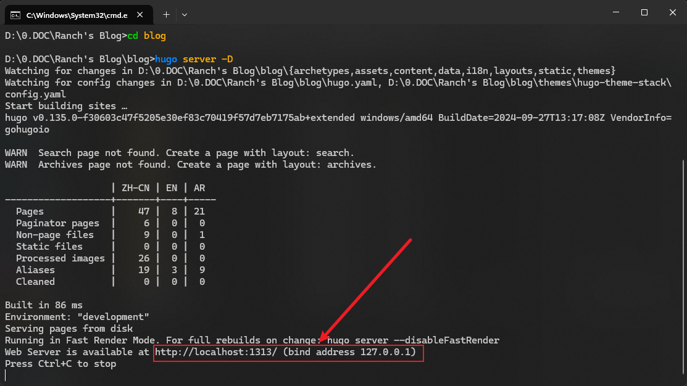

- `Ctrl`+鼠标左键点击上方链接，进入演示站点，如需停止在命令行输入`Ctrl+C`停止服务（`hugo`默认是没有主题的，后面会进行一个主题配置）

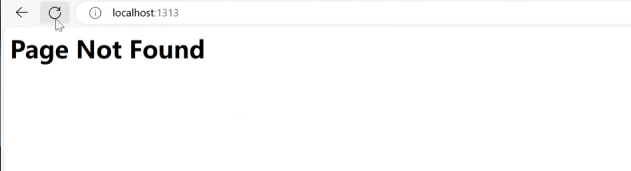

### 导入主题

- （1）前往【[Hugo Themes](https://themes.gohugo.io/)】，选择一个自己中意的主题

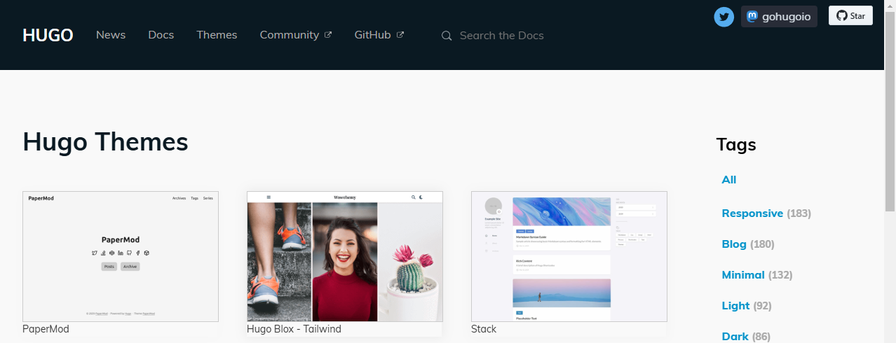

- （2）安装主题一般而言存在三种方式：
	1. git submodule 安装
	2. 本地安装
	3. go module安装（需要安装Go语言）
- （3）我个人使用第一种方式，考虑到后续主题升级的难易，这算是最均衡的一种方式。具体的安装方法可以在各主题的说明中找到，我这里安装的是【[Stack](https://stack.jimmycai.com/)】。 在网站目录下，输入：

```cmd
# 前目录中初始化一个空的 Git 存储库
git init

# 将stack主题克隆到`themes`目录中，并将其作为Git子模块添加到当前项目中
git submodule add https://github.com/CaiJimmy/hugo-theme-stack/ themes/hugo-theme-stack
```

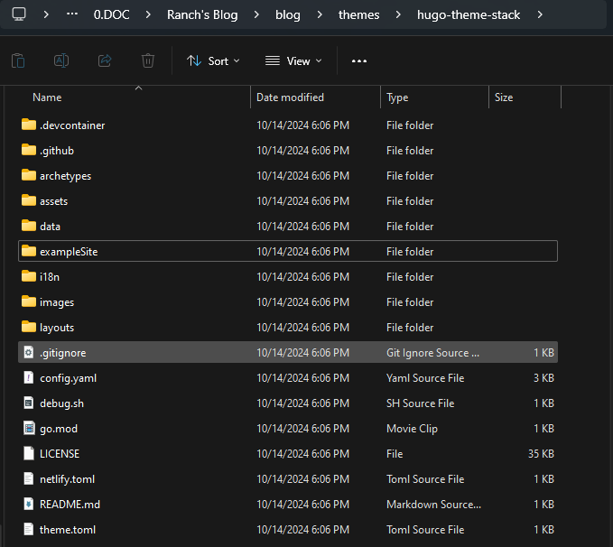

等待下载完成后，便可以进行后面的配置了。假如你想用其他方式安装，也可以参考[这里](https://stack.jimmycai.com/guide/getting-started)。Stack本身有全英文的[说明文档](https://stack.jimmycai.com/config/)，
- （4）等待下载完成。建议将`exampleSite`样例数据中的`**Content**和**hugo.yaml**复制到主文件夹中

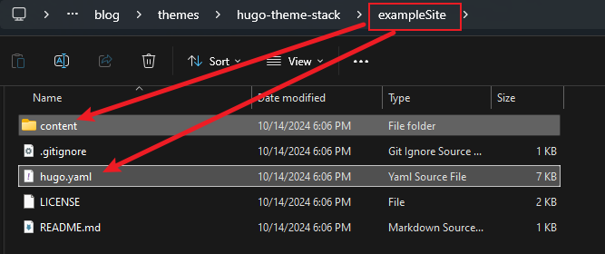

- （4）进入主文件下的`content\post`，并删掉`rich-content`文件夹（不然会报错）

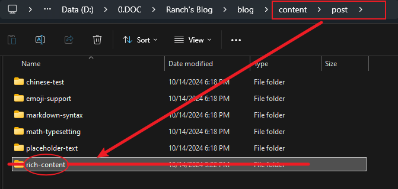

- （5）再次启动hugo服务，查看主题。具体主题配置细节放在下一篇。

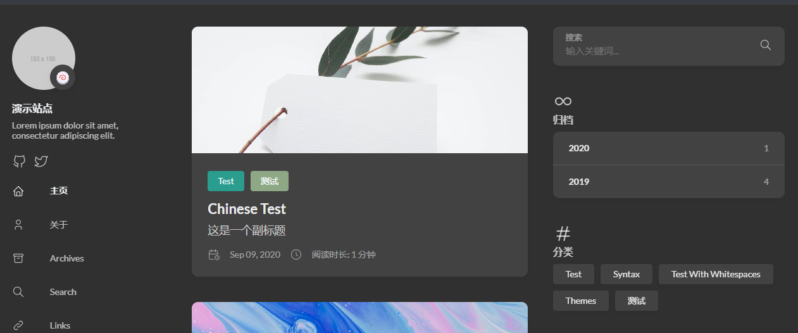


## GitHub部署

### 常规部署
- （1）前往【[GitHub官网](https://github.com)】，登录或者注册一个GitHub账号，创建新的仓库{`GitHub用户名`}.github.io（这里我已经注册了）

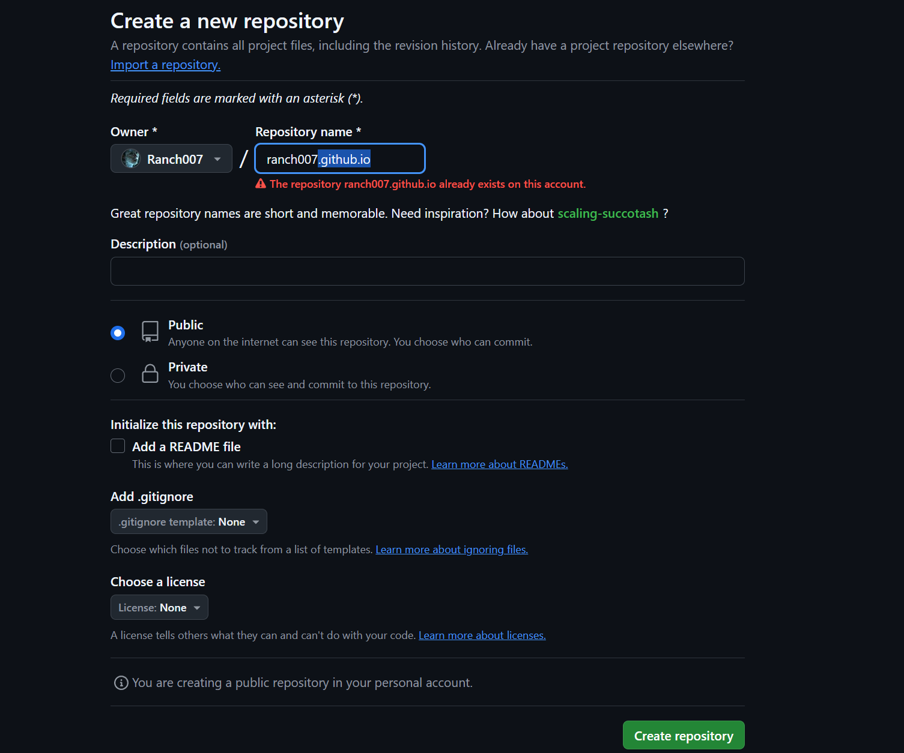

- （2）前往进入`xxx.github.io`仓库，从`Setting -> Pages`先将`source`的“从分支部署“切换到”GitHub操作“，初始化一下，再切回“分支部署”

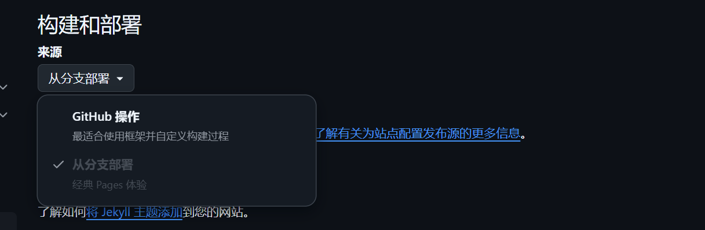

然后`Branch`出现”main分支“，选择`main`保存。

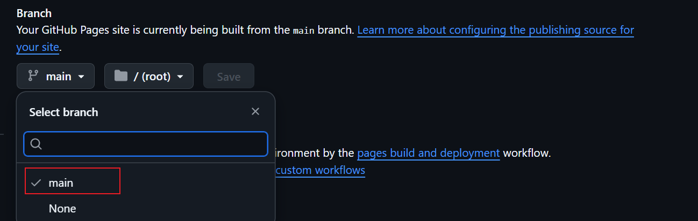

（Tips：现在需要先将内容推送到GitHub才能开启GitHub Pages网址。）

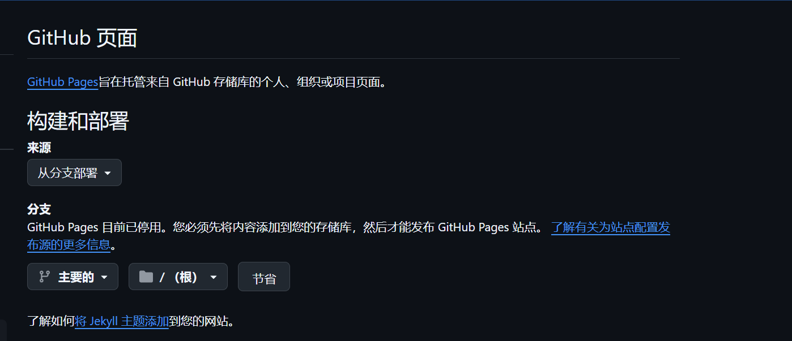

- （3）回到本地博客的主文件夹。准备发布网站，执行以下命令，Hugo 会在`public`在项目根目录中创建整个静态网站

```cmd
hugo -D
```

- （4）接着在进入 **public** 文件夹，执行以下命令上传到github仓库上，第一次上传可能需要输入账号密码

```
git init
git add .
git commit -m "first commit"
git branch -M main
git remote add origin https://github.com/{你的GitHub用户名}/{用户名.github.io}
git push -u origin main
```

- （5）前往`https://github.com/{GitHub用户名}/{用户名}.github.io`，点击`Branch`判断有没有上传成功

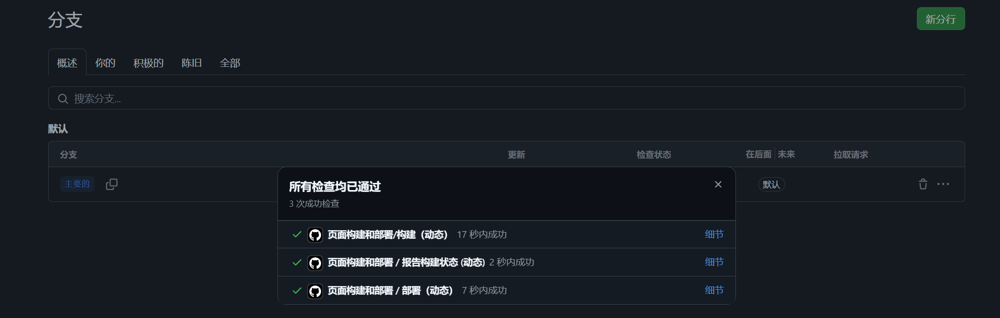

### 自动化部署

- 具体要求

如果想使用 Github Actions 自动部署 hugo 博客，则最起码需要创建两个 Github 的仓库。

>1. 第①个，便是存储博客 .md 源文件的地方，其实就是 hugo的主文件；
>2. 第②个，则是部署 Github Pages 的仓库（存放**public**文件夹里的所有文件），仓库名必须是 `<GitHub用户名>.github.io`，这是 github 官方要求的。

- 原理流程
>1.当我们提交博客 .md 源文件到仓库 ① 后，利用 Github Actions 自动执行 hugo 的命令
>2.在 `public` 目录下会自动生成静态网站，然后再将 `public` 目录推送到仓库 ②
>3.由于仓库② 是 Github Pages，它接着就会自动执行部署的命令。

- （1）我们需要从主文件的仓库①推送到外部 GitHub Pages 仓库②，需要特定权限，所以还得在 GitHub 账户 `Setting - Developer settings - Personal access tokens` （https://github.com/settings/tokens）下创建一个 Token：

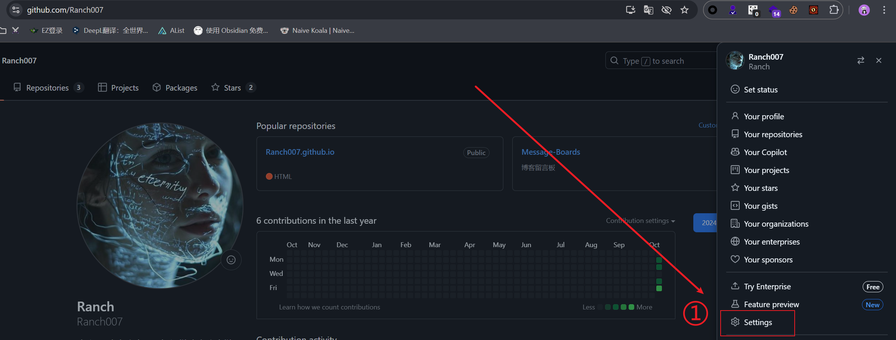

进入设置，`Developer settings`就在设置左下角，如下图点进去（需要验证）

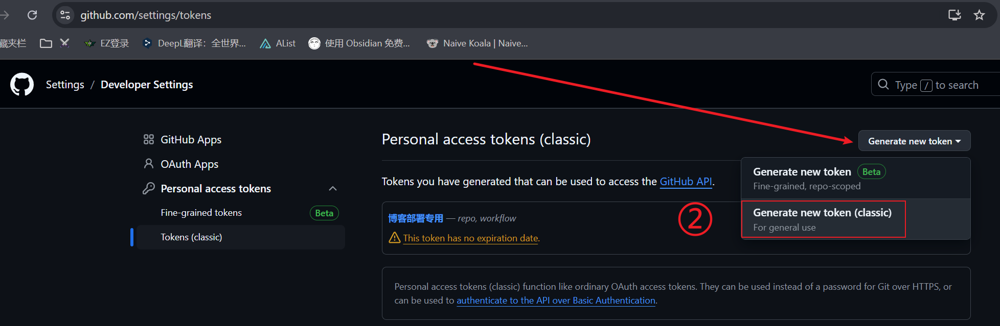

如下图进行配置，创建一个永久性`token`，并复制
（**Tips**：切记！！Token只会出现一次，请做好留存、保密）

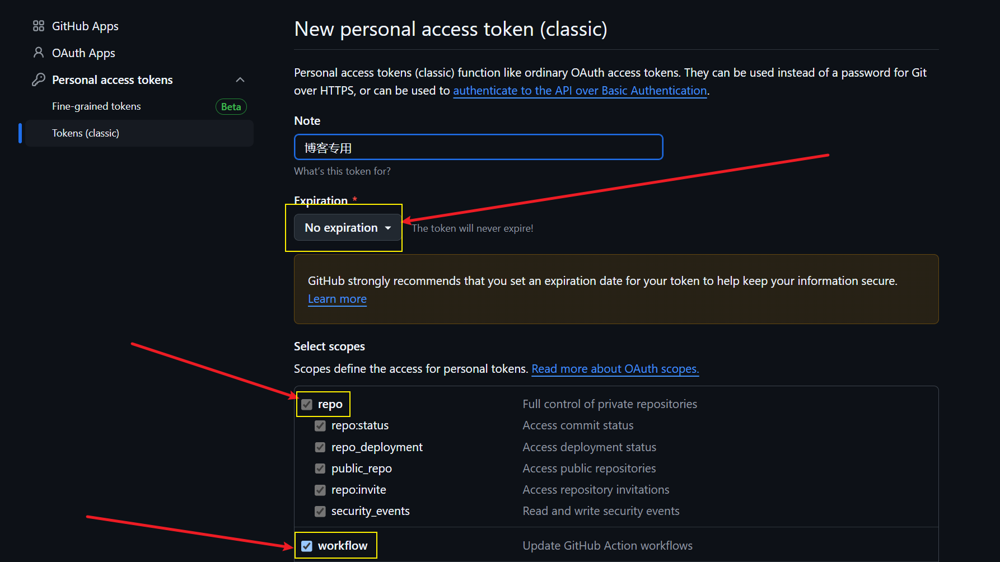

最后，来到以`github.io`结尾的仓库①。添加一个 secret，保存并命名你复制的`token`值，这个`Name`下一步需要用到。

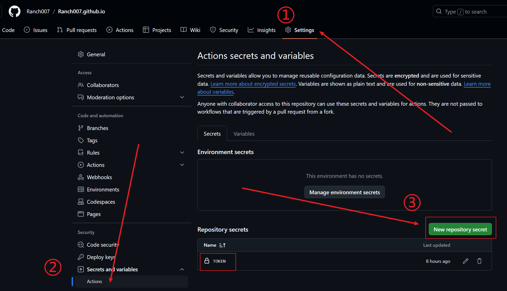

- （2）管理博客主文件的仓库①，点击 `Actions` 按钮，即可添加工作流文件，该文件一般是以 `.yml` 结尾，这样才能被 GitHub 识别

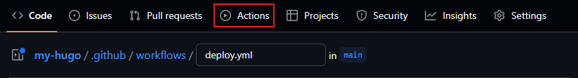

我创建的文件名为`deploy.yml`，内容如下：

```yaml
name: deploy

# 代码提交到main分支时触发github action
on:
  push:
    branches:
      - main	# 这里的意思是当 master分支发生push的时候，运行下面的jobs
      
jobs:
  deploy:	# 任务名自取
    runs-on: ubuntu-latest	# 在什么环境运行任务
    steps:
        - name: Checkout
          uses: actions/checkout@v4	# 引用actions/checkout这个action，与所在的github仓库同名
          with:
 			 submodules: true	# Fetch Hugo themes (true OR recursive) 获取submodule主题
              fetch-depth: 0	 # Fetch all history for .GitInfo and .Lastmod

      	- name: Disable quotePath
      	  run: git config --global core.quotePath false

        - name: Setup Hugo	# 步骤名自取
          uses: peaceiris/actions-hugo@v3	# hugo官方提供的action，用于在任务环境中获取hugo
          with:
              hugo-version: "latest"	# 获取最新版本的hugo
              extended: true

        - name: Build Web
          run: hugo -D	# 使用hugo构建静态网页
          
        - name: Deploy Web
          uses: peaceiris/actions-gh-pages@v4	# 一个自动发布github pages的action
          with:
              personal_token: ${{ secrets.{保存toekn的Name} }}	# 发布到其他repo需要提供上面生成的personal access token
              external_repository: {GitHub用户名}/{用户名}.github.io	# 发布到哪个repo
              publish_branch: main	# 发布到哪个branch
              publish_dir: public	# 注意这里指的是要发布哪个文件夹的内容，而不是指发布到目的仓库的什么位置，因为hugo默认生成静态网页到public文件夹，所以这里发布public文件夹里的内容
              commit_message: auto deploy
```

这样，我们的博客网站就部署好了，这极大地简化了我们发布文章的流程。

## 附录

### 参考文献

- [【Hugo】Hugo + Github 免费部署自己的博客 (letere-gzj.github.io)](https://letere-gzj.github.io/hugo-stack/p/hugo/custom-blog/)
- [使用 Hugo 对博客的重建与 Stack 主题优化记录](https://oxidane-uni.github.io/p/%E4%BD%BF%E7%94%A8-hugo-%E5%AF%B9%E5%8D%9A%E5%AE%A2%E7%9A%84%E9%87%8D%E5%BB%BA%E4%B8%8E-stack-%E4%B8%BB%E9%A2%98%E4%BC%98%E5%8C%96%E8%AE%B0%E5%BD%95/)
- [使用 Github Actions 自动部署 hugo 博客](https://smc.im/post/deploy-hugo-blog-with-github-actions/)
- [Github Actions 自动部署 Hugo](https://fanrongbin.com/github-actions-deploy-hugo/)

### 版权信息

本文原载于 [Ranch's Blog](https://ranch007.github.io)，遵循 CC BY-NC-SA 4.0 协议，复制请保留原文出处。
