---

> [!TIP]
>
> 避免踩坑的建议：
>
> **凡是需要更改的文件都从`themes/主题`复制到主目录（`hugo new site xxx`创建的那个）下**
>
> 接下来的个性化配置文件建议都在博客主目录下操作，减少更新主题时个性化配置被覆盖的麻烦
>
> 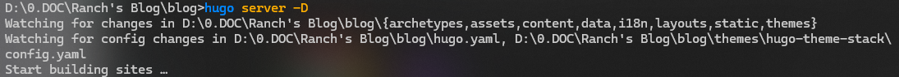
>
> 每次服务启动，会同步更新所有位置配置文件，但主目录配置文件优先级最高

---

## 导入主题

安装主题一般而言存在三种方式：

- git submodule 安装
- go module 安装（需要安装 Go 语言）
- 本地安装

​	我个人更推荐第一种方式，考虑到后续升级的难易，这算是最均衡的一种方式。具体的安装方法可以在各主题的说明中找到，我这里安装的是【[Stack](https://stack.jimmycai.com/)】。 在网站根目录下，输入：

```cmd
git submodule add https://github.com/CaiJimmy/hugo-theme-stack/ hugo-theme-stack

# 更新主题
git submodule init	//初始化子模块
git submodule update	//更新子模块到最新版本
```

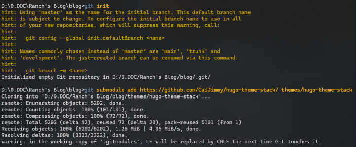

​	等待下载完成后，便可以进行【[配置](https://oxidane-uni.github.io/p/%E4%BD%BF%E7%94%A8-hugo-%E5%AF%B9%E5%8D%9A%E5%AE%A2%E7%9A%84%E9%87%8D%E5%BB%BA%E4%B8%8E-stack-%E4%B8%BB%E9%A2%98%E4%BC%98%E5%8C%96%E8%AE%B0%E5%BD%95/##%e4%b8%bb%e9%a2%98%e9%85%8d%e7%bd%ae%e5%8e%86%e7%a8%8b)】了。假如你想用其他方式安装，也可以参考【[这里](https://stack.jimmycai.com/guide/getting-started)】，而且Stack本身有全英文的【[说明文档](https://stack.jimmycai.com/config/)】。我建议是将`./themes/hugo-theme-stack/exampleSite/`文件下的`content`和`hugo.yaml`直接复制到博客主目录下（这是一个作者放的例子，这里面有许多提示），根据说明与需求修改，会剩下很多时间。

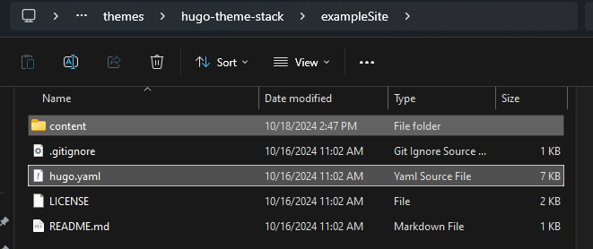

## 基础配置

### 打开`hugo.yaml`

​	本地调试的时候`baseurl`可以设置为`http://localhost:1313`。调试完推送到GitHub上，记得改为网站根目录，有疑问请参考【[这里](https://gohugo.io/methods/site/baseurl/)】。

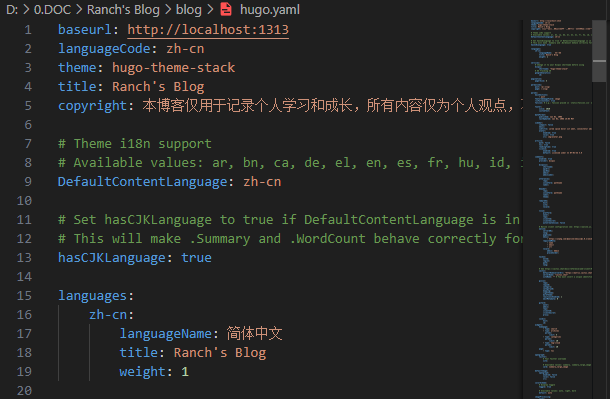

### 网站 `icon`、时间格式、博客头像

- 网站icon存储路径：`/static/favcion.ico`
- Go语言时间格式：
- 博客头像存储路径：`/assets/img/avatar.png`

`favicon`、`avatar`的路径格式如下图所示

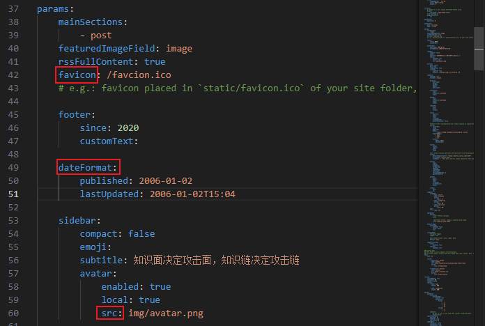

### `License`和留言板功能

- `license`：做好公共版权许可协议声明
- `comments`：进入【[Giscus](https://giscus.app/zh-CN)】官网，在线安装app，进入Giscus的配置页面，根据官方提示配置留言板功能。

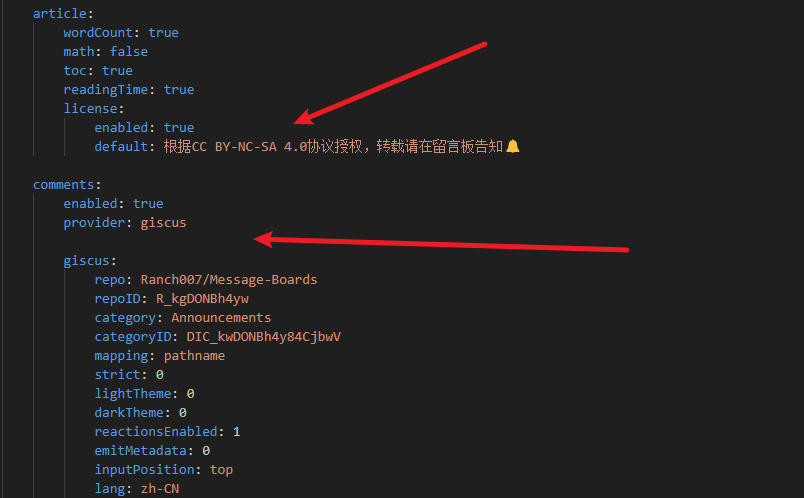

这里我也给出我的配置，仅供参考。`Message-Boards`是我新建的一个留言板专属存放的`public`仓库。

```yaml
    comments:
        enabled: true
        provider: giscus

        giscus:
            repo: Ranch007/Message-Boards
            repoID: R_kgDONBh4yw
            category: Announcements
            categoryID: DIC_kwDONBh4y84CjbwV
            mapping: pathname
            strict: 0
            lightTheme: 0
            darkTheme: 0
            reactionsEnabled: 1
            emitMetadata: 0
            inputPosition: top
            lang: zh-CN
```

### 社交功能

- 加入个人社交平台的链接
- `icon`路径：博客主目录的`/assets/icons`下，所有`icon`都在这里，都是`svg`文件。

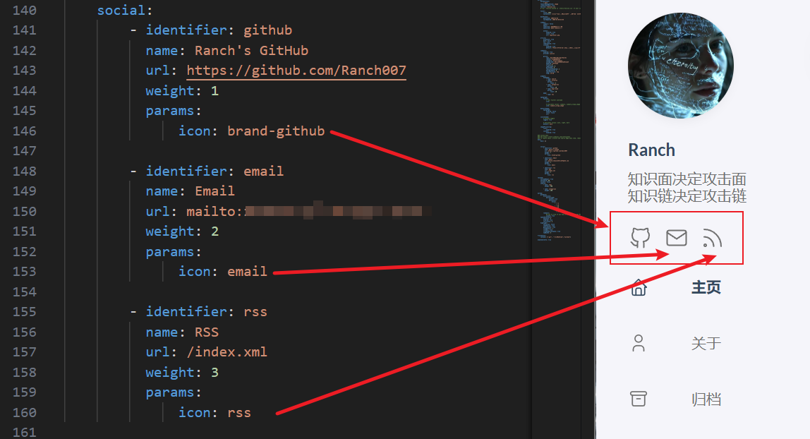

## 主题魔改

### 整体布局

照抄Naive Koala老师的文章《[Hugo-theme-Stack 魔改美化](https://www.xalaok.top/post/stack-modify/)》，文章写的很细心也很用心，属于喂饭教程。

> [!NOTE]
>
> 1.没有目录的自己创建一个同名目录，切记要仔细保证这些单词准确
>
> 2.代码看不懂没事，读文章尝试理解，看一下作者改的那些代码，那就是实现变动的关键点

这里涉及到复制的文件分别有：

```
themes\hugo-theme-stack\assets\scss\custom.scss 复制到 /assets/scss/custom.scss

themes\hugo-theme-stack\layouts\partials\footer\custom.html 复制到 /layouts/partials/footer/custom.html

themes\hugo-theme-stack\assets\scss\partials\sidebar.scss 复制到 /assets/scss/partials/sidebar.scss（这里需要下载两个icon，记得更改好指定命名保存到/assets/icons；还涉及到去代码中更改，作者有提供行数，版本不一样所以不一定准确，所以得审一下代码，注意缩进）

themes\hugo-theme-stack\layouts\partials\sidebar\left.html 复制到 /layouts/partials/sidebar/left.html

themes\hugo-theme-stack\assets\scss\grid.scss 复制到 /assets/scss/grid.scss

themes\hugo-theme-stack\layouts\index.html 复制到 /layouts/index.html

在 static 文件夹下新建 code-header.svg（macOS 风格红绿灯图标）

themes\hugo-theme-stack\assets\scss\partials\layout\article.scss 复制到 /assets/scss/partials/layout/article.scss

“显示语言和复制按钮”与代码行自带的copy重叠了，这里我没有弄
```

如果你想更从容一点，可以提前把上面的文件复制主目录。开始魔改前，记得整体备份一下。

### 一些细节

#### 添加文章开头更新时间和字数统计

​	在`layouts\partials\article\components\details.html`文件中，红框标记的就是增添组件的代码，黄框标记的就是两个组件的`icon`命名（目录在`/assets/icons`下）

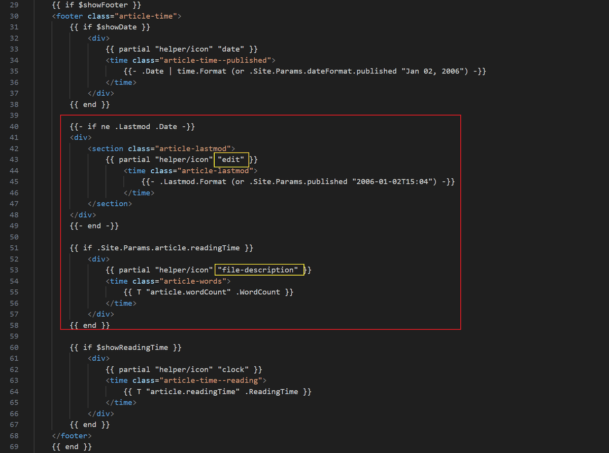

下图所示，就是增添后的文章标题组件

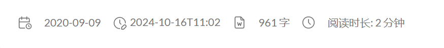

#### 添加文章末尾最后更新时间

​	在博客主文件夹下 `layouts\partials\article\components\footer.html`更新下面代码：

```html
<footer class="article-footer">
    {{ partial "article/components/tags" . }}
    {{ if and (.Site.Params.article.license.enabled) (not (eq .Params.license false)) }}
    
    <section class="article-copyright">
        {{ partial "helper/icon" "copyright" }}
        <span>{{ default .Site.Params.article.license.default .Params.license | markdownify }}</span>
    </section>
    {{ end }}

    {{- if ne .Lastmod .Date -}}
        <div>
            <section class="article-lastmod">
                {{ partial "helper/icon" "edit" }}
                    <time class="article-lastmod">
                        {{ T "article.lastUpdatedOn" }}{{- .Lastmod.Format (or .Site.Params.published "2006-01-02T15:04") -}}
                    </time>
            </section>
        </div>
    {{- end -}}
    
</footer>
```

通过上面代码第16行，`article.lastUpdatedOn`添加“最后更新于”


#### 添加网站运行时间组件

​	打开`layouts\partials\footer\footer.html`文件，将下面代码插入

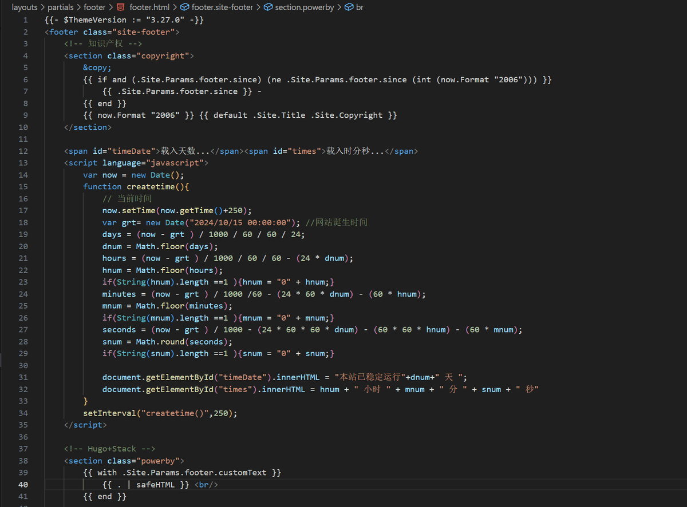

```html
    <span id="timeDate">载入天数...</span><span id="times">载入时分秒...</span>
    <script language="javascript"> 
        var now = new Date();
        function createtime(){
            // 当前时间
            now.setTime(now.getTime()+250);
            var grt= new Date("2024/10/15 00:00:00"); //网站诞生时间
            days = (now - grt ) / 1000 / 60 / 60 / 24;
            dnum = Math.floor(days);
            hours = (now - grt ) / 1000 / 60 / 60 - (24 * dnum);
            hnum = Math.floor(hours);
            if(String(hnum).length ==1 ){hnum = "0" + hnum;}
            minutes = (now - grt ) / 1000 /60 - (24 * 60 * dnum) - (60 * hnum);
            mnum = Math.floor(minutes);
            if(String(mnum).length ==1 ){mnum = "0" + mnum;}
            seconds = (now - grt ) / 1000 - (24 * 60 * 60 * dnum) - (60 * 60 * hnum) - (60 * mnum);
            snum = Math.round(seconds);
            if(String(snum).length ==1 ){snum = "0" + snum;}

            document.getElementById("timeDate").innerHTML = "本站已稳定运行"+dnum+" 天 ";
            document.getElementById("times").innerHTML = hnum + " 小时 " + mnum + " 分 " + snum + " 秒"
        }
        setInterval("createtime()",250); 
    </script> 
```

该组件效果展示：

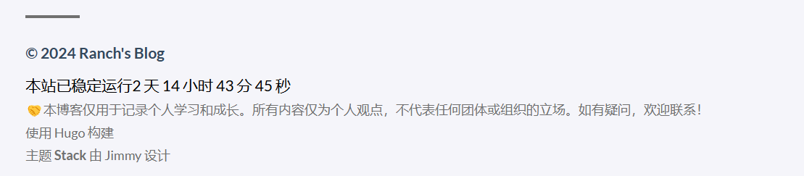

#### 左侧栏 ID 和简介换行

​	找到`layouts\partials\footer\footer.html`中下方代码，更改为

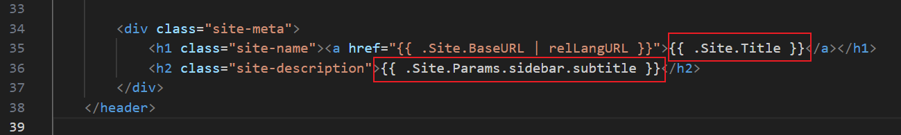

可以按照个人需求对下面代码进行调整，我将“个人ID”直接写进代码，通过更改`subtitle`实现换行

```html
        <div class="site-meta">
            <h1 class="site-name"><a href="{{ .Site.BaseURL | relLangURL }}"><span>Ranch</span></a></h1>
            <h2 class="site-description">{{ .Site.Params.sidebar.subtitle1 }}<br>{{ .Site.Params.sidebar.subtitle2 }}</h2>
        </div>


```

实际效果展示

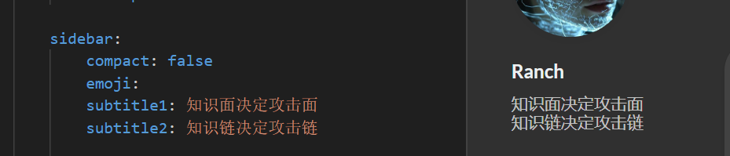

到这里使用Hugo➕Stack➕Giscus部署到GitHub的博客搭建和魔改美化就告一段落啦

后续如果有更新也会继续记录到`Blog`这个标签里

## 附录

### 参考文献

- 《[Hugo-theme-Stack 魔改美化](https://www.xalaok.top/post/stack-modify/)》
- 《[如何使用git submodule](https://zhuanlan.zhihu.com/p/660791672)》
- 《[将博客评论系统由 utterance 迁移至 giscus](https://oxidane-uni.github.io/p/%E5%B0%86%E5%8D%9A%E5%AE%A2%E8%AF%84%E8%AE%BA%E7%B3%BB%E7%BB%9F%E7%94%B1-utterance-%E8%BF%81%E7%A7%BB%E8%87%B3-giscus/)》
- 《[hugo stack 主题美化](https://yelleis.top/p/61fdb627/)》
- 《[建站技术 | 使用 Hugo + Stack 简单搭建一个博客](https://blog.reincarnatey.net/2023/build-hugo-blog-with-stack-mod/)》
- 《[Hugo和Github Action正确修改文章的最后更新日期](https://dnwzlx.com/posts/146871a6/)》

### 版权信息

本文原载于 [Ranch's Blog](https://ranch007.github.io)，遵循 CC BY-NC-SA 4.0 协议，复制请保留原文出处。

