---

title: "Win11使用JEnv管理多版本jdk"
slug: "JEnv-for-Windows 安装与配置完全指南"
description: 
date: "2024-10-22T19:37:09+08:00"
image: jenv-for-windows.png
math: 
license: 
hidden: false
draft: false 
categories: ["网安笔记"]
tags: ["windows","环境"]

---

---

## JEnv 介绍

>【[JEnv-for-Windows](https://github.com/FelixSelter/JEnv-for-Windows)】是一个专为Windows系统设计的开源工具，由FelixSelter开发，其核心功能是让开发者能够轻松地在不同版本的Java开发工具包（JDK）之间进行切换。

### 关键技术和框架

- **批处理脚本**：用于创建快捷的Java版本切换逻辑；
- **PowerShell脚本**：用于环境变量的动态管理，兼容性增强，以及更高级的操作；
- **无需额外依赖**：直接通过环境变量和脚本操作来实现JDK版本的管理。

### 这是如何运作的呢？

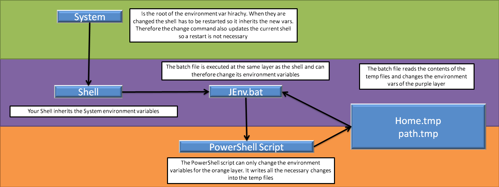

## 准备工作和详细安装步骤

### 步骤一：下载JDK并配置

#### 安装 JDK

- jdk-1.8

正常一步一步安装【[jdk-8u421-windows-x64.exe](https://www.oracle.com/sg/java/technologies/downloads/#license-lightbox)】


- jdk-xxx

将其他版本jdk的.zip压缩包解压到对应文件夹

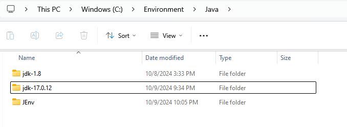

- 最终目录结构可参考：

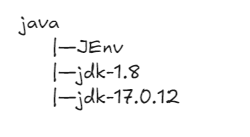

#### 配置环境变量

①新建系统变量JAVA_HOME，路径为jdk8路径

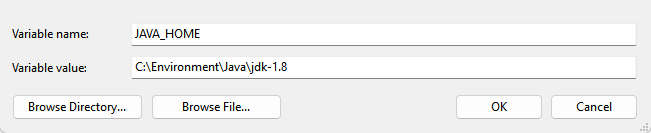

②新建系统变量CLASSPATH，指定类搜索路径

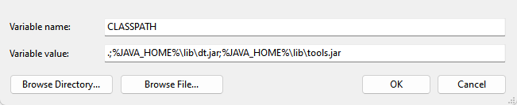

③系统变量Path中添加对应路径

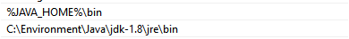

### 步骤二：JEnv-for-Windows项目获取

从GitHub克隆该仓库到本地对应文件夹

```cmd
git clone https://github.com/FelixSelter/JEnv-for-Windows.git
```


### 步骤三：JEnv环境准备

#### 删除旧的JAVA_HOME

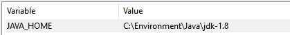

#### 添加JEnv到系统路径

将刚克隆的项目路径添加到系统的环境变量Path中，确保可以从任何地方调用jenv.bat脚本。

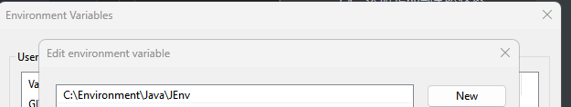

### 步骤四：初始化与配置

#### 首次运行JEnv

```cmd
jenv -help
```

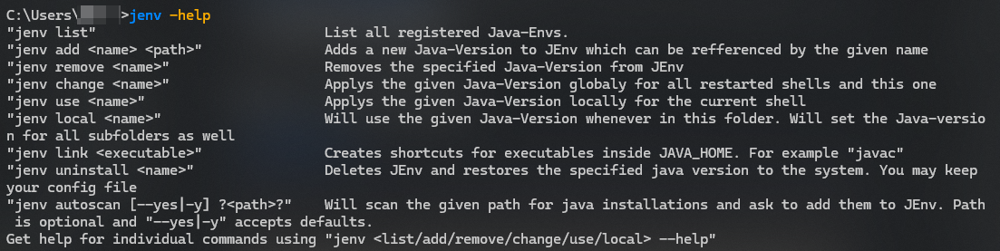

#### 添加JAVA环境

接下来，将其他版本jdk添加到JEnv管理中

```cmd
jenv add jkd8 C:\Environment\Java\jdk-1.8
jenv add jdk17 C:\Environment\Java\jdk-17.0.12
```

#### 步骤五：验证

列出jenv管理的所有jdk版本：

```cmd
jenv list
```

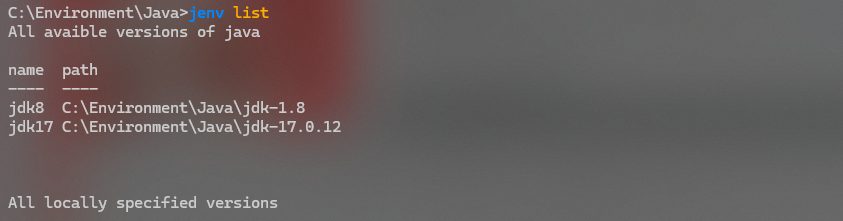

用命令切换jdk版本：

```cmd
jenv use {name}
```

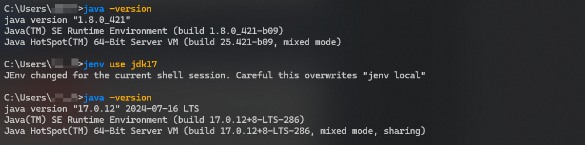

## 日常操作及使用方法

1. **添加新的Java环境（需要绝对路径）**  
    _jenv add`<name> <path>`_  
    示例：`jenv add jdk15 D:\Programme\Java\jdk-15.0.1`
    
2. **更改当前会话的 java 版本**  
    _jenv use`<name>`_  
    示例：`jenv use jdk15`  
    脚本编写的环境变量：  
    ---PowerShell: `$ENV:JENVUSE="jdk17"`  
    ---CMD/BATCH:`set "JENVUSE=jdk17"`
    
3. **清除当前会话的 java 版本**  
    _jenv use remove_  
    示例：`jenv use remove`  
    用于脚本编写的环境变量：  
    ---PowerShell: `$ENV:JENVUSE=$null`  
    ---CMD/BATCH:`set "JENVUSE="`
    
4. **全局更改您的 java 版本**  
    _jenv change`<name>`_  
    示例：`jenv change jdk15`
    
5. **始终在此文件夹**  
    _jenv local`<name>`_  
    中使用此 java 版本 示例：`jenv local jdk15`
    
6. **清除此文件夹的 java 版本**  
    _jenv local remove_  
    示例：`jenv local remove`
    
7. **列出所有 Java 环境**  
    _jenv list_  
    示例：`jenv list`
    
8. **从 JEnv 列表中删除现有的 JDK**  
    _jenv remove`<name>`_  
    示例：`jenv remove jdk15`
    
9. **允许使用位于 java 目录**  
    _jenv link`<Executable name>`_  
    中的 javac、javaw 或其他可执行文件 示例：`jenv link javac`
    
10. **卸载 jenv 并自动恢复您选择的 Java 版本**  
    _jenv uninstall`<name>`_  
    示例：`jenv uninstall jdk17`
    
11. **自动搜索要添加的 java 版本**  
    _jenv autoscan [--yes|-y]`?<path>?`_  
    示例：`jenv autoscan "C:\Program Files\Java"`  
    示例：`jenv autoscan`// 将搜索整个系统 示例：`jenv autoscan -y "C:\Program Files\Java"`// 将接受默认值

## 附录

### 参考文献

- [JEnv-for-Windows 安装与配置完全指南](https://blog.csdn.net/gitblog_07878/article/details/142224949?utm_medium=distribute.pc_relevant.none-task-blog-2~default~baidujs_baidulandingword~default-4-142224949-blog-132979387.235%5Ev43%5Epc_blog_bottom_relevance_base9&spm=1001.2101.3001.4242.3&utm_relevant_index=7)

### 版权信息

本文原载于 [Ranch's Blog](https://ranch007.github.io)，遵循 CC BY-NC-SA 4.0 协议，复制请保留原文出处。
