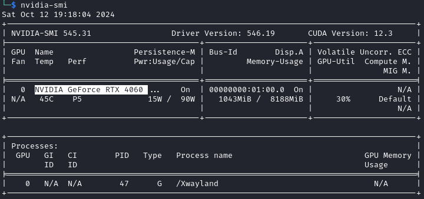
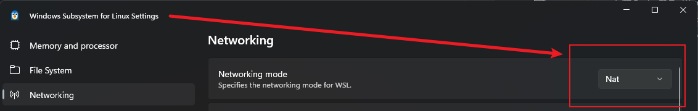
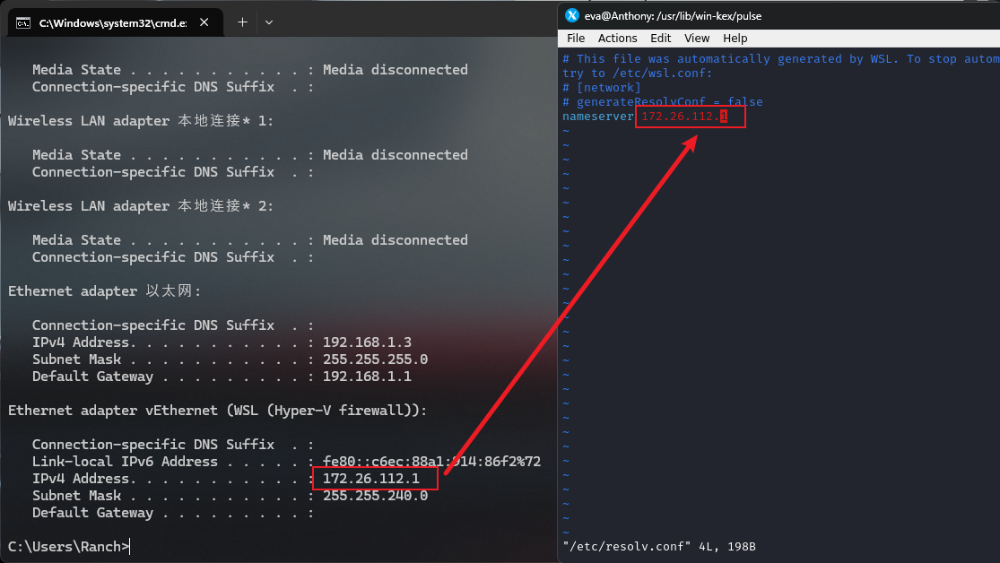

---

## 前置条件

### CPU 虚拟化

- 修改BIOS设置（VMX/AMD-v）

### windows 功能

- 适用于Linux的windows子系统
- 虚拟机平台

## 安装

### 默认 ubuntu 发行版

管理员权限打开 cmd

```cmd
wsl --install kali-linux --web-download
```

### 查看在线发行版

```cmd
wsl --list --online
```

### 查看安装的子系统

```cmd
wsl --list -v
```

如果 windows下 sublinux 安装出现“不能访问网络位置+有关网络排除故障的信息”

```cmd
netsh winsock reset
netsh int ip reset all
netsh winhttp reset proxy
ipconfig /flushdns
```

## 使用

### 切换默认子系统

```cmd
wsl --set-default xxx
```

### 启动指定的子系统

```cmd
wsl -d kali-linux
```

### 卸载

```cmd
wsl --unregister kali-linux
```

### 备份

```cmd
# 导出
wsl --export kali-linux kali.tar

# 导入
wsl --import kali2 D:/wsl C:\Users\admin\Desktop

```

## kali 打开桌面窗口

### wsl2 黑科技

#### WSLg

允许 Linux 里面带有UI的应用程序，直接以 Windows 窗口的形式打开

#### 显卡直通

```cmd
# 查看显卡
nvidia-smi
```



#### 镜像网络模式

在 `C:\Users\xxx` 下面创建 `.wslconfig` 文件

```shell
[wsl2]
networkingMode = mirrored
```

然后保存，使用 `wsl --shutdown` 关闭虚拟机，等 8 秒。

### kali 安装 Win-Kex

> 参考官方文档：【[Win-Kex为Kali Linux提供GUI桌面体验](https://www.kali.org/docs/wsl/win-kex/)】
>
> win-kex支持以下三种模式

#### 窗口模式

> 要在支持声音的 Window 模式下启动 Win-KeX，请运行以下任一命令：

- Kali WSL 内部：`kex --win -s`
- 在 Windows 的命令提示符上：`wsl -d kali-linux kex --win -s`

有关更多信息，请参阅【 [Win-KeX 窗口模式使用文档](https://www.kali.org/docs/wsl/win-kex-win/)】。

#### 增强的会话模式

> 要在具有声音支持和 ARM 解决方法的增强会话模式下启动 Win-KeX
>
> 请运行以下任一命令：

- Kali WSL 内部：`kex --esm --ip -s`
- 在 Windows 的命令提示符上：`wsl -d kali-linux kex --esm --ip -s`

有关更多信息，请参阅【 [Win-KeX 增强型会话模式使用文档](https://www.kali.org/docs/wsl/win-kex-esm/)】。

#### 无缝模式

使用无缝模式（win-kex SL），请在WSL设置里，将网络模式更改为`NAT`



进入kali系统，修改`/etc/resolv.conf`文件里的`nameserver`，其IP地址与windows中`vEthernet (WSL (Hyper-V firewall))`IP地址一致。



>要在具有声音支持的无缝模式下启动 Win-KeX，请运行，运行以下任一：

- Kali WSL 内部：`kex --sl -s`
- 在 Windows 的命令提示符上：`wsl -d kali-linux kex --sl -s`

有关更多信息，请参阅【 [Win-KeX SL 使用文档](https://www.kali.org/docs/wsl/win-kex-sl/)】。

## 附录

### 参考文献

《[WSL2 + linux配置流程超详细指南 | mednight4](https://archived.mednight4.com/2021/02/08/wsl2-linux-pei-zhi-liu-cheng-chao-xiang-xi-zhi-nan/)》

### 版权信息

本文原载于 [Ranch's Blog](https://ranch007.github.io)，遵循 CC BY-NC-SA 4.0 协议，复制请保留原文出处。
