---

title: "掌握 Docker魔法：Windows 11 平台上的完美容器部署终极指南"
slug: "掌握 Docker魔法：Windows 11 平台上的完美容器部署终极指南"
description: 
date: "2024-11-08T21:43:41+08:00"
image: docker.png
math: 
license: 
hidden: false
draft: false 
categories: ["网安笔记"]
tags: ["环境"]
---

---


## 前言

### 什么是 Docker ？

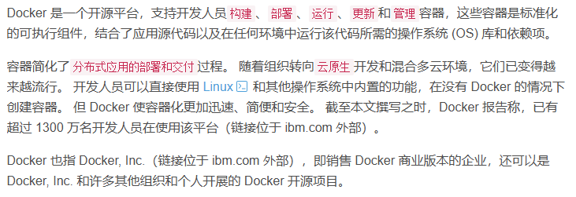

### 容器工作的原理


### 容器的架构

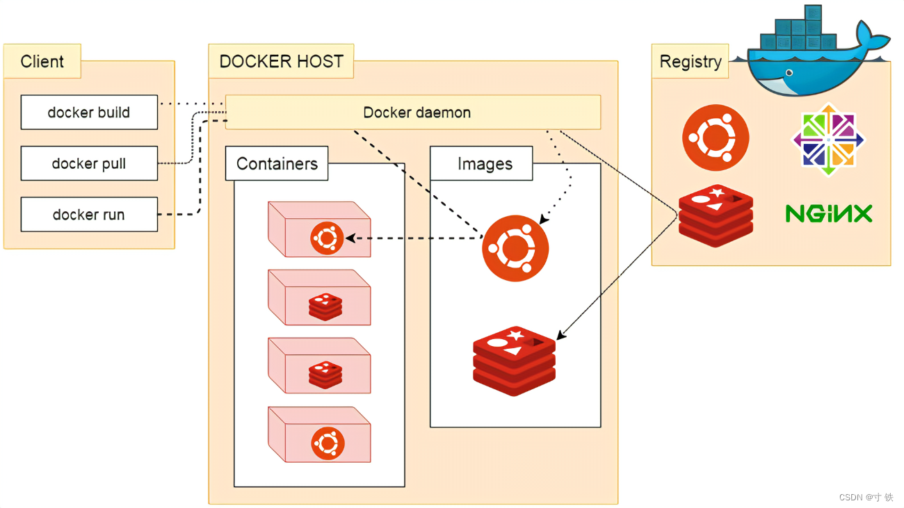

Docker包括三个基本概念：
- **镜像（Image）**：Docker 镜像（Image），就相当于是一个 root 文件系统。比如官方镜像 ubuntu:16.04 就包含了完整的一套 Ubuntu16.04 最小系统的 root 文件系统。
- **容器（Container）**：镜像（Image）和容器（Container）的关系，就像是面向对象程序设计中的类和实例一样，镜像是静态的定义，容器是镜像运行时的实体。容器可以被创建、启动、停止、删除、暂停等。
- **仓库（Repository）**：仓库可看成一个代码控制中心，用来保存镜像。

###  Docker 的优势

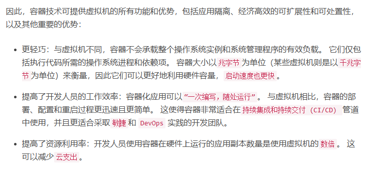

### 为何使用 Docker ？

Docker 支持开发人员使用简单的命令访问这些本机容器化功能，并通过节省工作量的应用程序编程接口 (API) 自动执行。 与 LXC 相比，Docker 提供了以下功能：
- 增强的无缝容器**可移植性**：虽然 LXC 容器通常引用特定于机器的配置，但 Docker 容器无需修改即可在任何桌面、数据中心和云环境中运行。
- 更轻巧且**更细粒度的更新**：通过使用 LXC，可以在单个容器中组合多个进程。 这样就可以构建持续运行的应用，即使为了更新或修复而关闭某个部分也不例外。
- **自动化容器创建**：Docker 可以基于应用源代码自动构建容器。
- **容器版本控制**：Docker 可以跟踪容器映像的版本，回滚到先前的版本，以及跟踪版本的构建者和构建方式。 它甚至可以<font color="#e5b9b7">只上传现有版本和新版本之间的增量</font>。
- **容器复用**：现有容器可用作<font color="#e5b9b7">基本映像</font>（本质上类似于用于构建新容器的模板）。
- **共享容器库**：开发人员可以访问包含数千个用户贡献容器的<font color="#e5b9b7">开源注册表</font>。

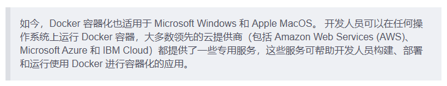

---

>在初步认识了解了`Docker`后，下面正式进入`Docker`安装环节！

## 安装

### 进入Docker官网
首先先到Docker官网下载最新官方Docker for Windows链接：【[下载Docker](https://docs.docker.com/get-started/get-docker/)】

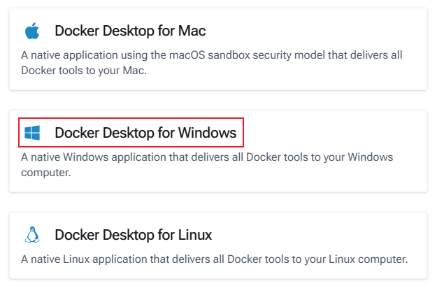

### 启动 Microsoft Hyper-V

在电脑上打开“控制面板”->“程序”-> “启动或关闭Windows功能”。

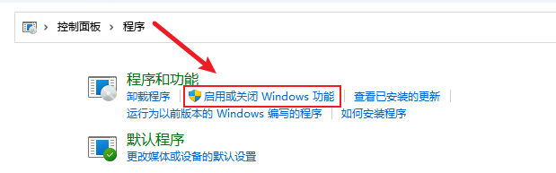

勾选`Hyper-V`功能

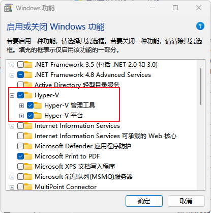

并勾选以下功能

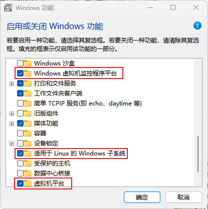

### 重启后安装Docker

双击安装 docker

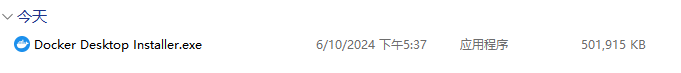

默认配置

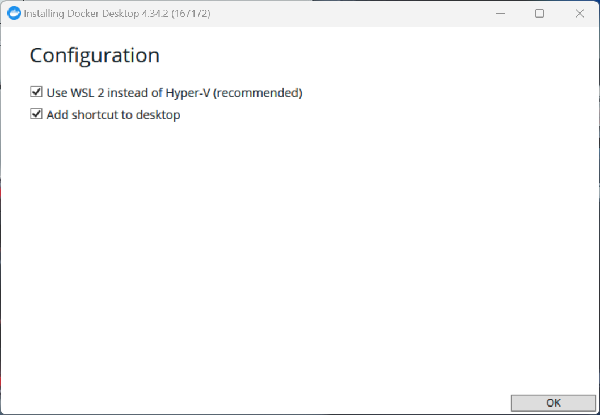

等待安装结束

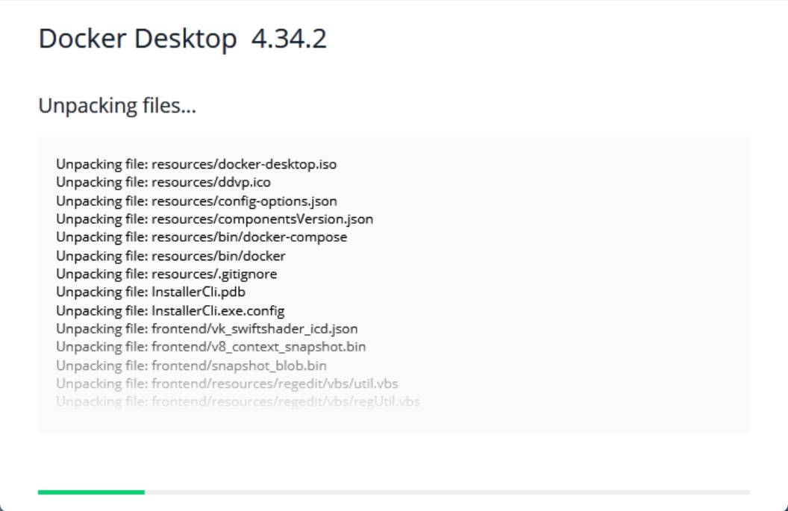

安装完毕后，点击`Close and log out`

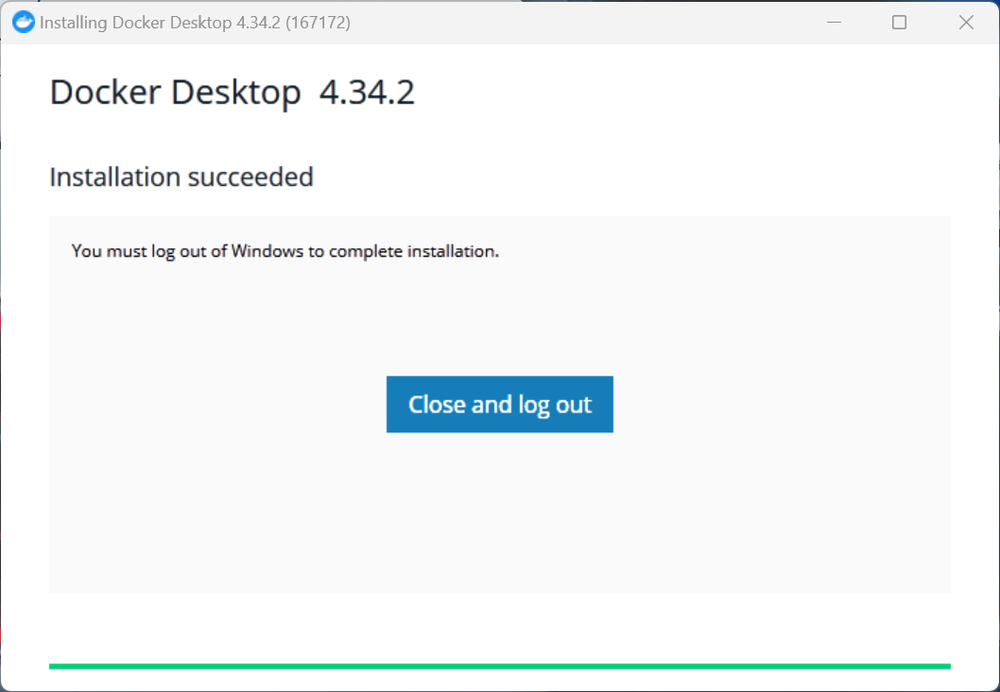

电脑重启后，点击`Docker`程序


现在程序就正常启动啦

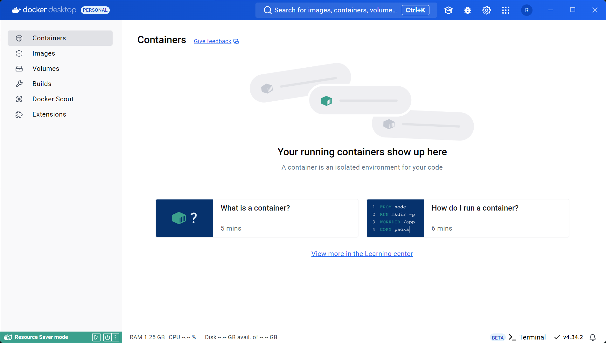

## ~~加速~~

### 配置aliyun镜像加速

- 如果`pull`操作比较慢，接下来需要配置一下镜像代理，便于更快速的拉取资源！
- 登录aliyun官网：《[镜像加速器](https://account.aliyun.com/login/login.htm?oauth_callback=https%3A%2F%2Fcr.console.aliyun.com%2Fcn-hangzhou%2Finstances%2Fmirrors&clearRedirectCookie=1&lang=zh)》

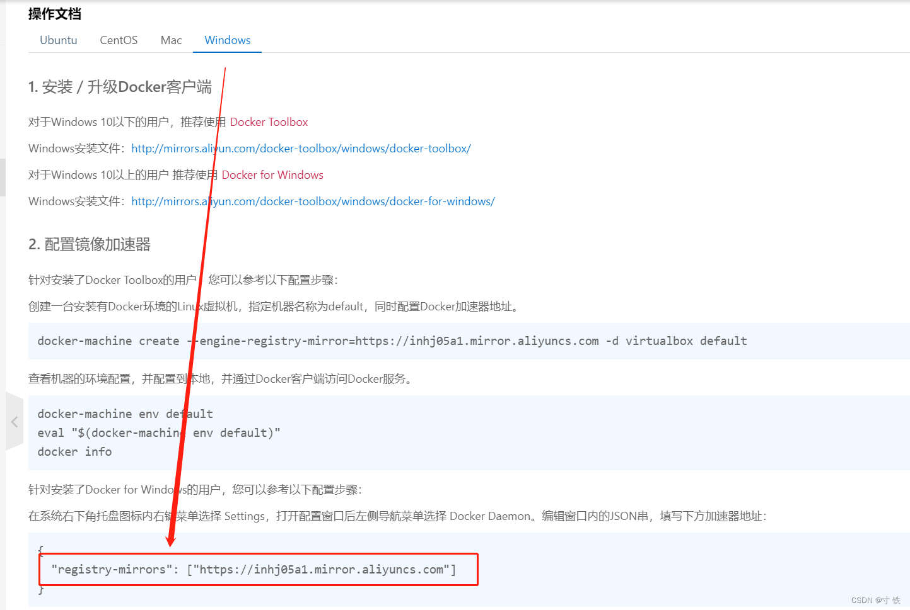

## 使用

### 查看

```cmd
docker --versionn
```

### 获取镜像

```cmd
docker pull xxx
```

### 查看镜像

```cmd
docer images
```

### 删除镜像

```cmd
# 删除指定的镜像
docker rmi xxx.image

# 清理本地的Docker镜像
docker image prune -f
```

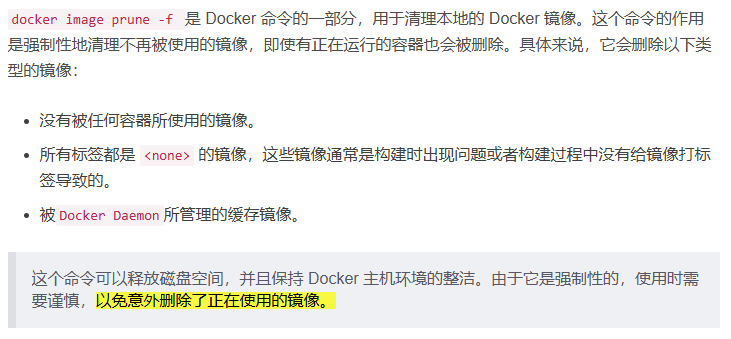

### 启动容器

以下命令使用xxx镜像启动一个容器，参数为以命令模式进入该容器：

```
docker run -it xxx /bin/bash
```

也可以：

```
docker run -it -rm --entrypoint /bin/bash 镜像名
```

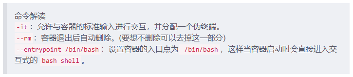

所以，更常用的是这种后台启动的方式:

```
docker run -itd xxx /bin/bash
```


### 交互容器

- 运行容器后正常启动状态，使用如下命令：

```cmd
# 先在后台启动
docker run -itd --entrypoint /bin/bash reqpython 

# 查看刚才run的容器名 如：test 
docker ps 

# 再进入容器内部
docker exec -it test /bin/bash 
```

- 只是做测试用，测试完后，不想保留容器，使用如下命令：

```cmd
docker run -it --rm --entrypoint /bin/bash 镜像名
```

### 删除容器

```cmd
# 删除单个
docker rm -f <容器ID>

# 批量删除
docker rm -f <容器ID>1 <容器ID>2 <容器ID>……
```

### 查看容器

```cmd
docker ps -a
```

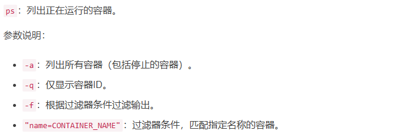

### 容器的暂停与恢复

```cmd
# 暂停容器的运行，但是容器并没有运行
docker pause <容器ID>

# 恢复容器的暂停
docker unpause <容器ID>
```

### 容器的停止与重启

```cmd
# 使用此命令会停止容器的运行,如果想不停止运行，可以使用暂停的命令。
docker stop <容器ID>

# 重启容器
docker restart <容器ID>
```

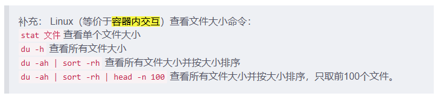

### 进入容器

- 先查看容器的名字
```cmd
docker ps -a
```

- 再使用如下命令进入容器
```cmd
docker exec -it 容器的名字 /bin/bash
```

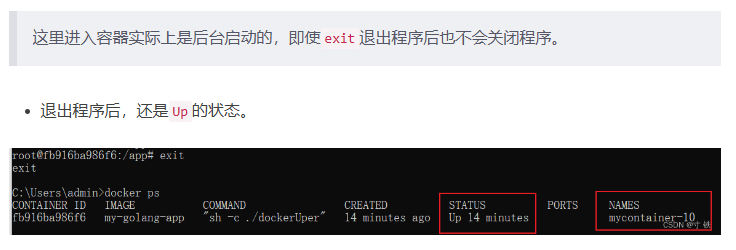

### 更新容器

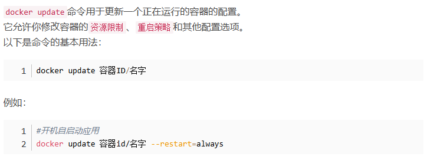

### 查看端口情况

#### 查看端口开发情况

```
netstat -nlpt
```

#### 查看端口占用情况

```cmd
# 查看所有
ps aux

# 查看指定服务
ps aux | grep docker
```

#### 查看端口映射

```cmd
docker port <容器ID>
```

### 查看进程号（PID）

- 先查找容器ID

```cmd
docker ps -a
```

- 传入<容器ID>查找PID

```cmd
docker inspect -f '{{.State.Pid}}' <容器ID>

docker container top <容器ID>

ps aux | grep <容器ID>
```

### 获取容器内部正在运行的任务的占用内存资源情况

```cmd
docker stats --no-stream <容器ID>
```

### 复制本地文件到容器内

```cmd
docker cp 本地文件路径 <容器ID>/<容器名>:容器内部存放文件位置
```

### 打包容器为镜像

```cmd
docker commit <容器ID> <打包后的镜像名>:<版本号>
```


## 附录

### 参考文献

《[【Docker】掌握 Docker魔法：Windows 11 平台上的完美容器部署终极指南](https://blog.csdn.net/joeyoj/article/details/136427362)》


### 版权信息

本文原载于 [Ranch's Blog](https://ranch007.github.io)，遵循 CC BY-NC-SA 4.0 协议，复制请保留原文出处。
