---

## 准备工作

### 下载 VS Code 安装包

官方下载链接：【[Visual Studio Code - Code Editing. Redefined](https://code.visualstudio.com/)】

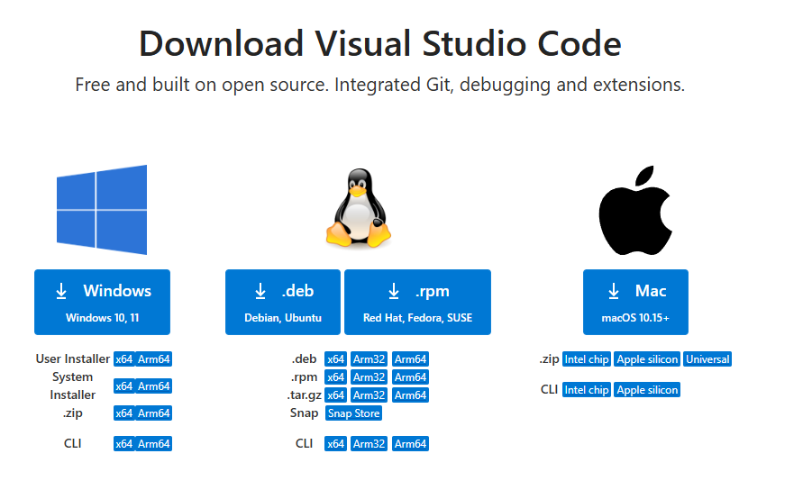

### 下载 Msys2

Github下载链接：【[msys2-installer](https://github.com/msys2/msys2-installer/releases/)】

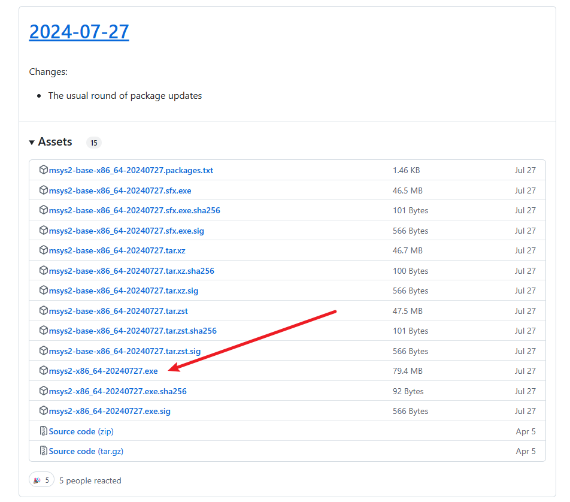

## 安装软件

### `VSCodeUserSetup-x64.exe`

- 双击运行`VSCodeUserSetup-x64-1.94.0.exe`运行安装程序

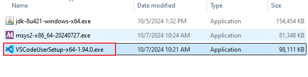

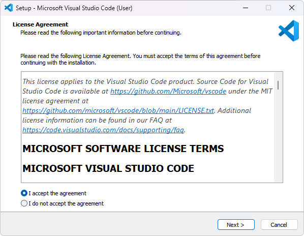

### `msys2-x86_64.exe`

- 双击`msys2-x86_64-20240727.exe`运行安装程序

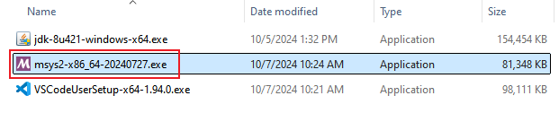

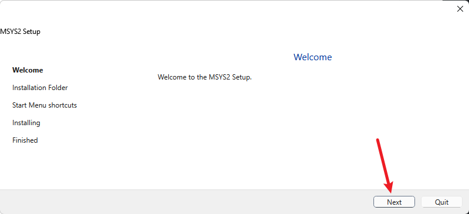

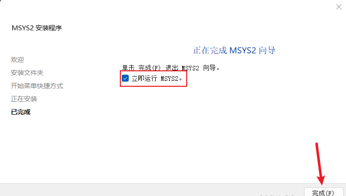

当按下`完成`之后，会弹出打开一个 MSYS2 终端窗口。

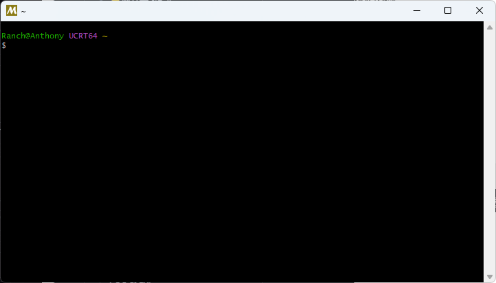

在此终端中，通过输入以下命令并按回车键，安装 MinGW-w64 工具链：
```shell
pacman -S --needed base-devel mingw-w64-ucrt-x86_64-toolchain
```
出现这个界面，直接按回车键，默认接受所有的安装包。

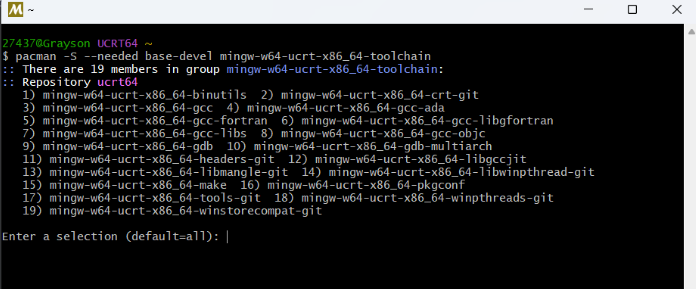

当系统提示是否继续安装时，请输入`y`并回车。

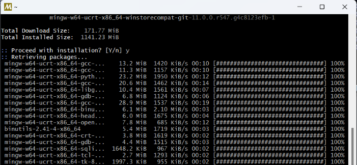

当所有的包都安装好后，直接关闭终端。
打开安装 MSYS2 的目录，先找到`ucrt64`文件夹并进入，再找到`bin`文件夹并进入，然后在地址栏中，复制路径。
如果一开始用默认路径，那路径就是`C:\msys64\ucrt64\bin`。


然后在搜索框中输入 `编辑系统环境变量`，并打开编辑系统环境变量的设置界面。

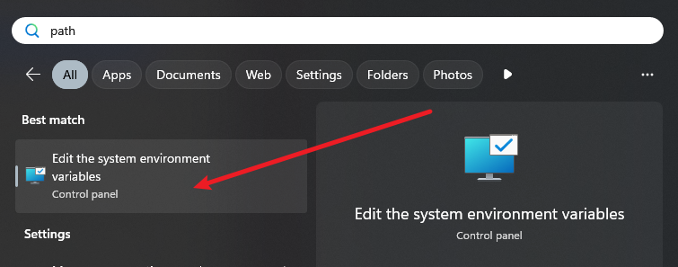在系统属性的弹窗中，点击`环境变量`。

在弹出的环境变量弹窗中，找到用户变量的`Path`，并双击打开。

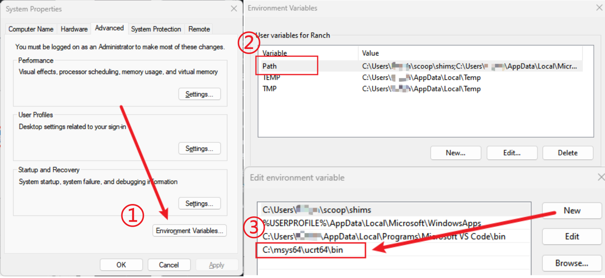

此时会弹出编辑环境变量的窗口，先点击`新建`按钮，然后会在空白行中出现一个输入框和一个闪烁的光标，在这里粘贴上刚刚复制的路径，最后点击`确定`按钮回到上层弹窗。

最后，依次点击右下角`确定`退出。
最后做一下测试，按组合键`Win + r`之后，输入`cmd`回车。

```cmd
gcc --version
g++ --version
gdb --version
```

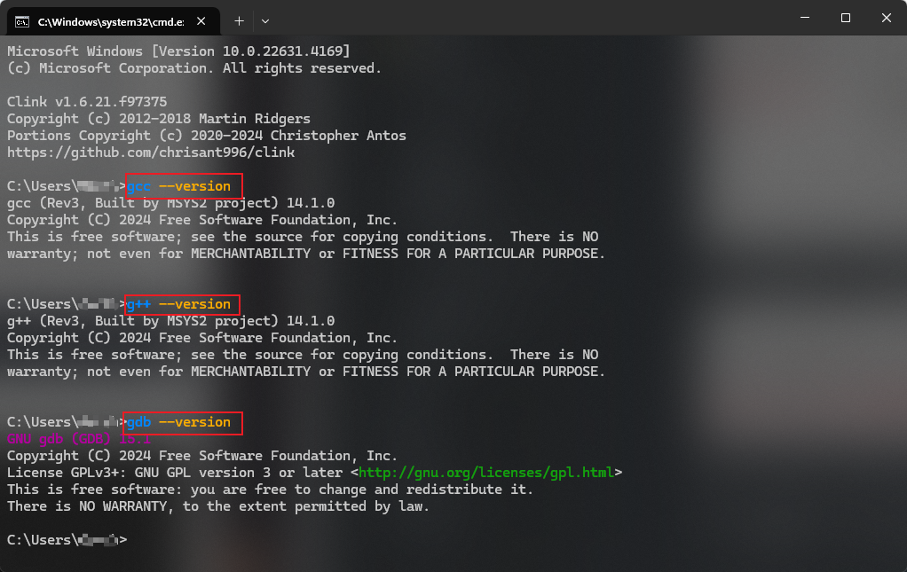

## 安装VS Code 扩展

### 汉化扩展包（可选）

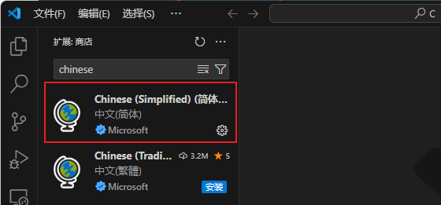

### C/C++ 环境扩展包

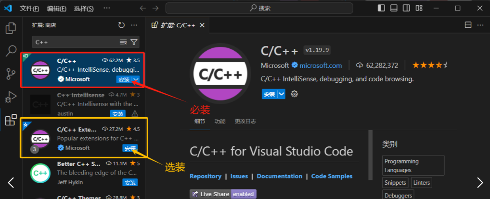

## 测试 VS Code 的 C/C++ 编程环境

### 创建代码文件夹

>VS Code 是一款基于文件夹进行代码编辑和管理的编辑器，通常我们会把新建一个文件夹来管理同一个项目的代码，并在 VS Code 中打开。

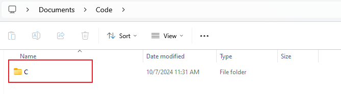

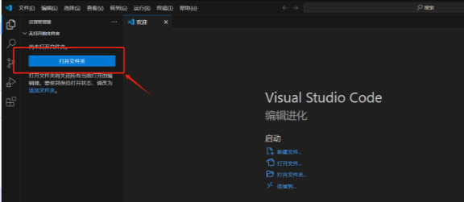

### 单个 .c 文件的运行和调试

为了方便管理代码，我们先选中`C`文件夹，再点击`新建文件夹`按钮。

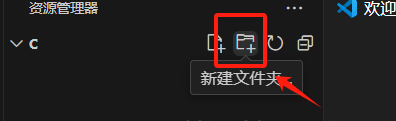

此时会在`C`文件夹的下级出现一个输入框，我们新建一个名为`test`的文件夹。


鼠标右键`test`文件夹，在弹出的菜单中选择`新建文件`。
在输入框中输入我们接下来要进行调试代码文件名，命名为`test.c`，注意，一定要是 .c 结尾。


接下来就可以输入一个调试程序了，我的代码如下：
```c
#include <stdio.h>
 
int main()
{
    for (int i = 0; i < 5; i++)
        printf("Hello Ranch~%d\n", i);

    return 0;
}
```
写好测试代码后，点击右上角的调试按钮，这时会弹出调试程序的选项，选择第一个，也是本教程前面安装的 gcc 编译工具。

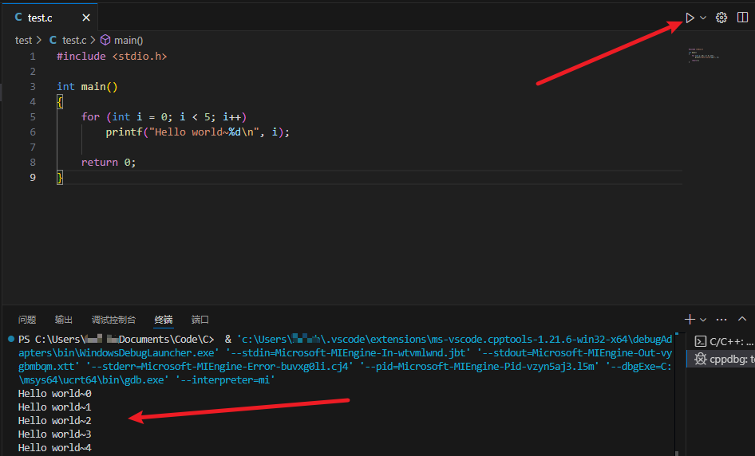

如果要进行简单的断点调试，可以在行号前加一个断点，操作也很简单，只需用鼠标左键点一下行号左边的空白处即可。
如下图所示，是在第六行处加了一个断点。

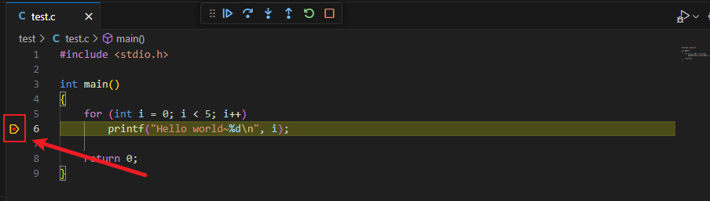

这时再去运行程序，搜索框下面就会出现调试的面板，面板上有六个按钮，分别是**继续**、**逐过程**、**单步调试**、**单步跳出**、**重启**和**停止**。

> [!IMPORTANT]
>
> 以下是 VS Code 中的 C 语言代码调试面板功能的解释：
>
> **继续（Continue）**：继续执行程序，直到遇到下一个断点或程序结束。
>
> **逐过程（Step Over）**：逐行执行当前行，如果当前行是函数调用，则进入该函数并执行完毕。
>
> **单步调试（Step Into）**：逐行执行当前行，如果当前行是函数调用，则进入该函数并停在函数内的第一行。
>
> **单步跳出（Step Out）**：执行完当前函数的剩余部分，并停在当前函数被调用的下一行。
>
> **重启（Restart）**：重新启动程序的调试会话，即从程序的起点开始执行。
>
> **停止（Stop）**：停止程序的调试会话，结束调试过程并关闭程序执行。

### 多个 .c 文件的运行与测试

如果想要进行多个 .c 文件编译后的调试，就需要进行一些配置修改。如果进行过一次编译运行，我们会发现在资源管理器的`C`文件夹下，多出一个`.vscode`的文件夹，这个文件夹里面有个`tasks.json`的文件

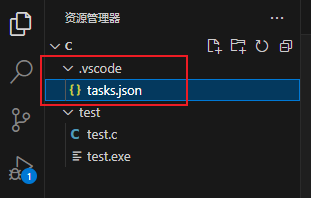

> 这个文件是用于定义任务配置，这些任务可以在 VS Code 中运行，例如编译代码、运行测试、启动调试器等。
>
> tasks.json文件是一个 JSON 格式的文件，其中包含了任务的配置信息，包括任务名称、命令、参数等。通过编辑tasks.json文件，我们可以自定义项目中的各种任务，并在 VS Code 中方便地执行这些任务。

当前的 VS Code 的运行效果还不是很理想，双击打开tasks.json文件修改一下编译运行功能。下图是对该 JSON 文件做了部分解释。

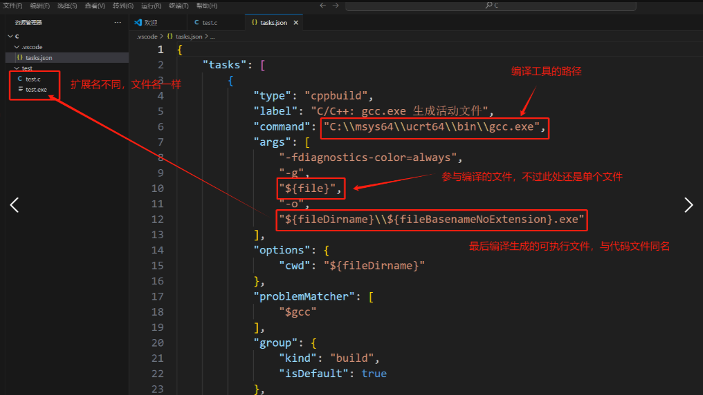

具体修改如下图所示，我注释掉了原来的`${file}`，并新增一行`*.c`，表示并非指定某一个` .c` 文件，而是当前文件夹下所有的` .c `文件。

同时也把`${fileDirname}\\${fileBasenameNoExtension}.exe`注释掉，改成`${fileDirname}\\program.exe`，那么多个` .c` 文件编译之后的可执行文件就是`program.exe`。

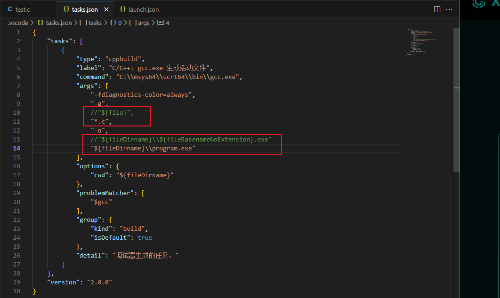

然后点击左侧的`运行与调试`，再点击`创建launch.json文件`。

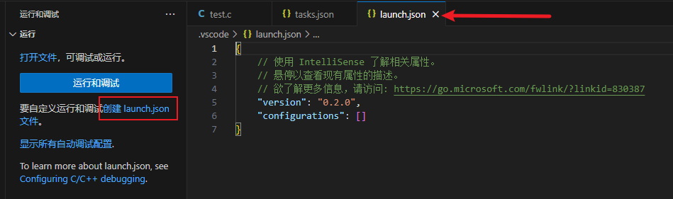

然后 VS Code 会新建一个 JSON 文件，点击右下角的`添加配置`，在弹出的下拉菜单中选择`C/C++：（gdb）启动`。

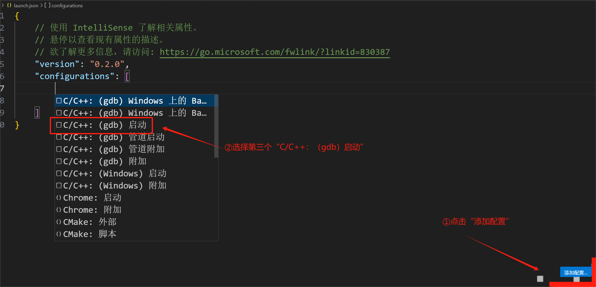

修改为下图红框所示内容，`“program”`后的内容就是前面提到的`tasks.json`文件中的编译后产生的可执行文件。`"miDebuggerPath"`后面的则是前面安装的 MinGW-W64 的 gdb 工具的路径。修改后保持关闭。

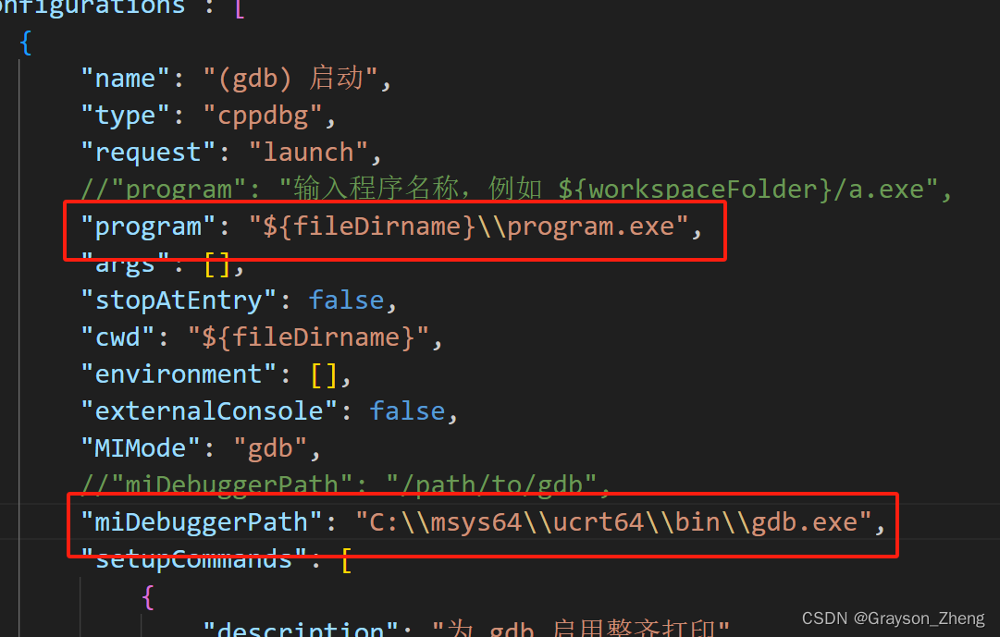

## 附录

### 参考文献

《[VS Code 配置 C/C++ 编程运行环境（保姆级教程）](https://blog.csdn.net/qq_42417071/article/details/137438374)》

### 版权信息

本文原载于 [Ranch's Blog](https://ranch007.github.io)，遵循 CC BY-NC-SA 4.0 协议，复制请保留原文出处。
