---

title: "Apache ActiveMQ Jolokia 后台远程代码执行漏洞（CVE 2022 41678）"
slug: "Apache ActiveMQ Jolokia 后台远程代码执行漏洞（CVE 2022 41678）"
description: 
date: "2024-11-10T19:11:16+08:00"
image: activemq.png
math: 
license: 
hidden: false
draft: false 
categories: ["网安笔记"]
tags: ["vulhub"]

---

---

>Apache ActiveMQ 是美国阿帕奇（Apache）软件基金会所研发的一套开源的消息中间件，它支持Java消息服务、集群、Spring Framework等。

ActiveMQ中，经过身份验证的用户默认情况下可以通过`/api/jolokia/`接口操作MBean，其中FlightRecorder可以被用于写Jsp WebShell，从而造成远程代码执行漏洞。

FlightRecorder存在于Jdk 11+，具体类名：`jdk.management.jfr.FlightRecorderMXBeanImpl`

---
## 影响范围

- Apache ActiveMQ before 5.16.6
- Apache ActiveMQ 5.17.0 before 5.17.4
- Apache ActiveMQ 5.18.0 unaffected
- Apache ActiveMQ 6.0.0 unaffected

## 环境构建

在`CVE-2022-41678`目录下执行如下命令启动一个Apache ActiveMQ 5.17.3服务器：
```cmd
docker compose up -d
```

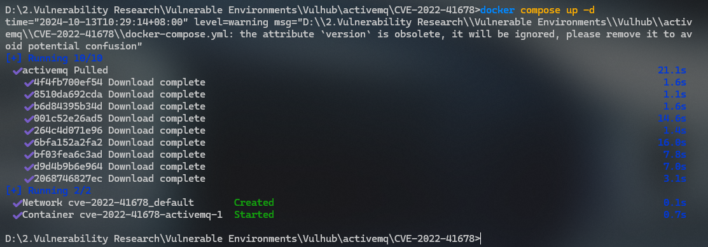

服务启动后，访问`http://your-ip:8161/`后输入账号密码`admin`和`admin`，即可成功登录后台。

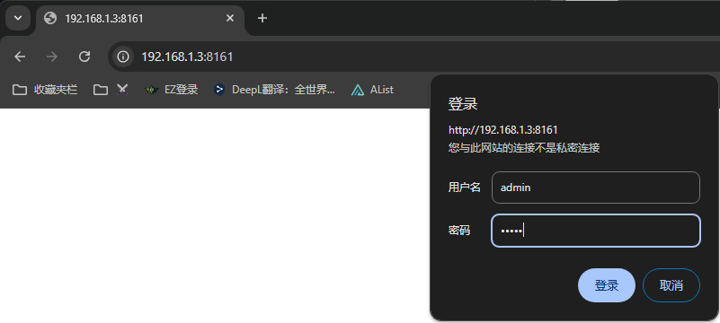

## 原理分析

漏洞入口在【 [http://localhost:8161/api/jolokia/](http://localhost:8161/api/jolokia/)】 ，⚠️注意需要带上Origin头才可以访问

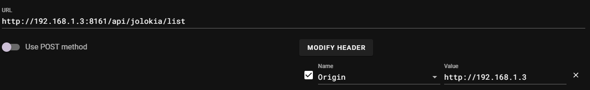

主要问题出在`FlightRecorder`这个`Mbean`，功能是记录内存，gc，调用栈等。
漏洞用到的方法主要是以下几个：

- `newRecording`：新建记录
- `setConfiguration`：更改配置
- `startRecording`：开始录制
- `stopRecording`：结束录制
- `copyTo`：导出录制文件

漏洞思路是通过`setConfiguration`修改配置，把一些键名改成jsp代码，记录的数据就会包含该jsp代码，录制完成后，通过copyTo导出到web目录即可

代码位置在 `jdk.management.jfr.FlightRecorderMXBeanImpl#setConfiguration`

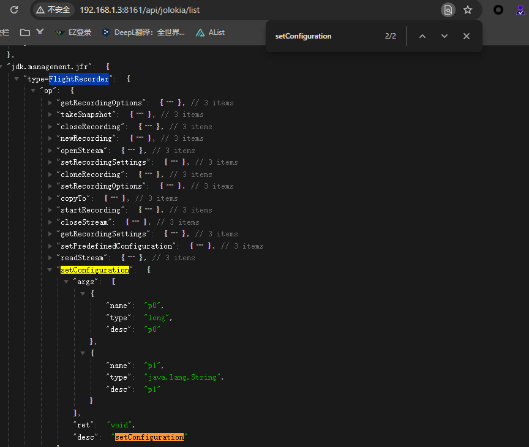

## 漏洞复现

首先，访问`/api/jolokia/list`这个API可以查看当前服务里所有的MBeans：

```
# 注意需要带上Origin头才可以访问
Origin:http://192.168.1.3
```

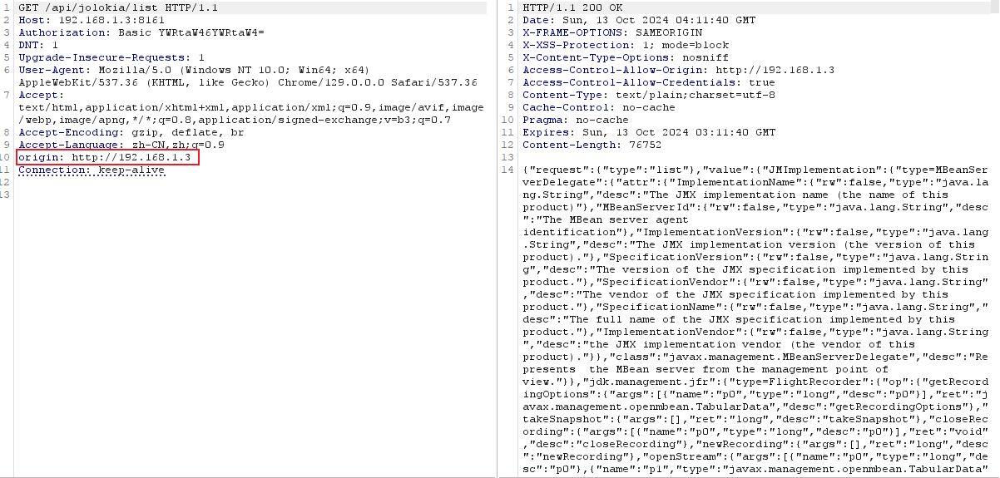

这其中有两个点可以被用来执行任意代码。

### 途径一

第一个方法是使用`org.apache.logging.log4j.core.jmx.LoggerContextAdminMBean`，这是由Log4j2提供的一个MBean。

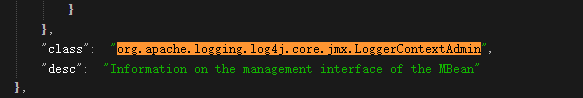

攻击者使用这个MBean中的`setConfigText`操作可以更改Log4j的配置，进而将日志文件写入任意目录中。

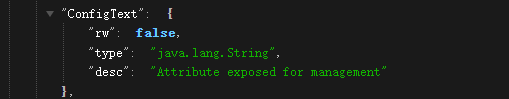

使用【[POC](https://github.com/vulhub/vulhub/blob/master/activemq/CVE-2022-41678/poc.py)】脚本来复现完整的过程：
```shell
pyhon poc.py -u admin -p admin http://your-ip:8161
```

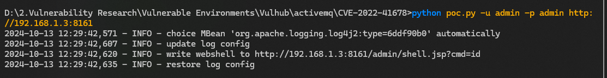

Webshell被写入在`/admin/shell.jsp`文件中：

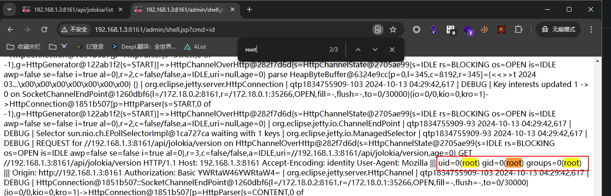

这个方法受到ActiveMQ版本的限制，因为**Log4j2是在5.17.0中才引入**Apache ActiveMQ。

### 途径二

第二个可利用的Mbean是`jdk.management.jfr.FlightRecorderMXBean`。

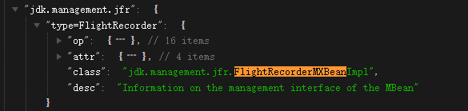

`FlightRecorder`是在OpenJDK 11中引入的特性，被用于记录Java虚拟机的运行事件。利用这个功能，攻击者可以将事件日志写入任意文件。

使用【[POC](https://github.com/vulhub/vulhub/blob/master/activemq/CVE-2022-41678/poc.py)】脚本来复现完整的过程（使用`--exploit`参数指定使用的方法）：
```shell
python poc.py -u admin -p admin --exploit jfr http://localhost:8161
```

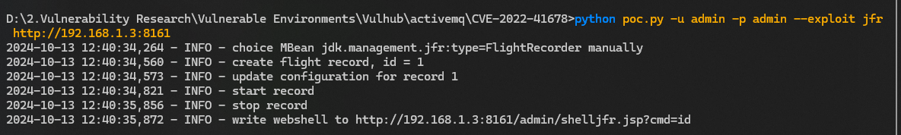

Webshell被写入在`/admin/shelljfr.jsp`文件中：

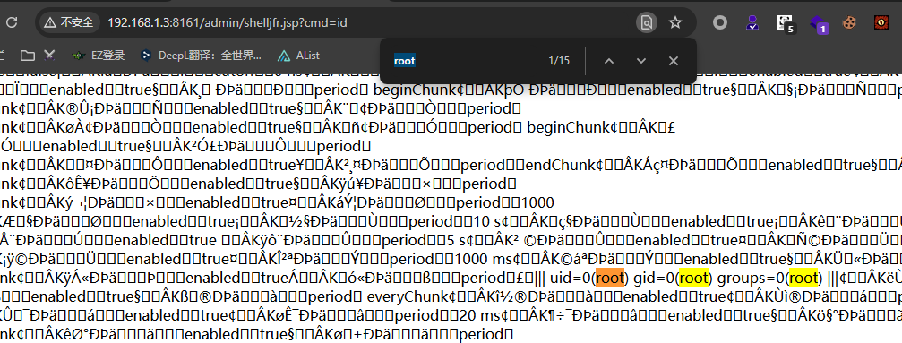

## 修复建议

- AMQ-9201 - Update Jolokia default access configuration · apache/activemq@6120169<br>
  GitHub： https://github.com/apache/activemq/commit/6120169e5)

## 附录

### 参考文献

- 《[Apache ActiveMQ Jolokia 远程代码执行漏洞(CVE-2022-41678)分析](https://l3yx.github.io/2023/11/29/Apache-ActiveMQ-Jolokia-%E8%BF%9C%E7%A8%8B%E4%BB%A3%E7%A0%81%E6%89%A7%E8%A1%8C%E6%BC%8F%E6%B4%9E-CVE-2022-41678-%E5%88%86%E6%9E%90/)》
- 《[Apache ActiveMQ历史漏洞复现合集](http://www.aqtd.com/nd.jsp?id=7505)》

### 版权信息

本文原载于 [Ranch's Blog](https://ranch007.github.io)，遵循 CC BY-NC-SA 4.0 协议，复制请保留原文出处。
