---

title: "【HCIA 路由与交换 Wakin 谢Sir】数通网络基础"
slug: "【HCIA 路由与交换 Wakin 谢Sir】数通网络基础"
description: 
date: "2024-11-11T21:06:03+08:00"
image: icipie.png
math: 
license: 
hidden: false
draft: false 
categories: ["网络技术"]
tags: ["HCIA"]

---

---

## 数通基础

### 什么是网络？
>网络的本质就是**实现资源共享**
>将各个系统连接到一起，形成信息传递、接收、共享的信息交互平台

### 万物互联
>人与人、人与物、物与物的互联
>本质是数据的联结与计算

### 数通是连结万物的“管道”

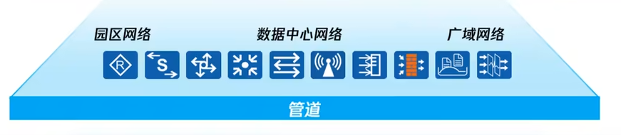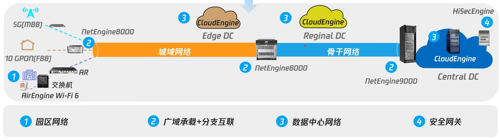

### 数通网络介绍

**Data Communication Network**

>一个典型的数通网络通常由路由器、交换机、防火墙、无线控制器、无线接入点、个人电脑、网络打印机、服务器等设备构成的通信网络，最基本的功能就是**实现数据互通**。
>而**网络拓扑图**就是呈现一个数通网路的结构化布局。

### 信息的传递

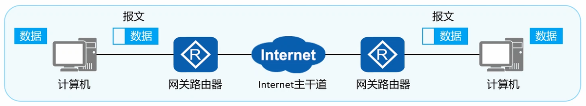

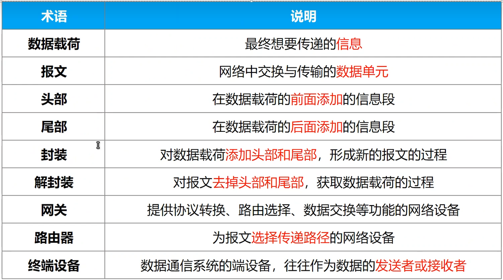

- ##### 带宽：bandwidth

描述在单位时间内传输的数量
单位：bps（bit per second，比特每秒）

- ##### 延迟：delay

描述数据传输所经历的时间
单位：ms（毫秒）

## 网络基础

### 网络模型

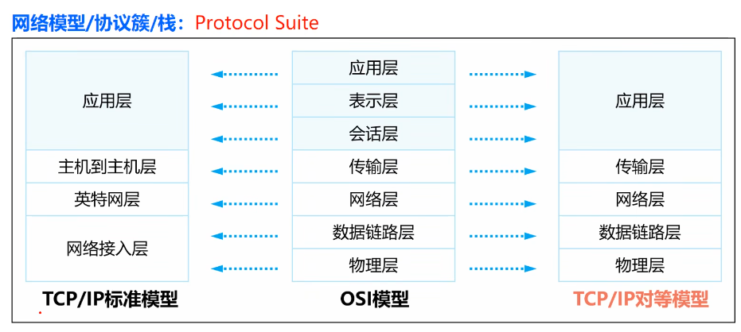

| OSI模型 |             作用             | TCP/IP模型 |
| :----------------------------------: | :--------------------------: | :-------------------------------------: |
|                应用层                |    为应用程序提供网络服务    |                   应                    |
|                表示层                |    数据格式化，加密、解密    |                   用                    |
|                会话层                |   建立、维护、管理会话连接   |                   层                    |
|                传输层                |  建立、维护、管理端到端连接  |                 传输层                  |
|                网络层                |       IP寻址和路由选择       |                 网络层                  |
|              数据链路层              | 控制网络层与物理层之间的通信 |               数据链路层                |
|                物理层                |          比特流传输          |                 物理层                  |

### 网络基础架构

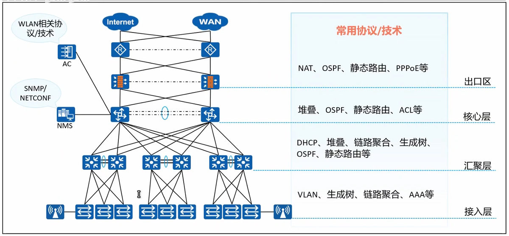

### 封装和解封装

**encapsulation & de-encapsulation**

- 数据发送时，逐层向下，添加相关头部或尾部的过程，称为封装（打包）

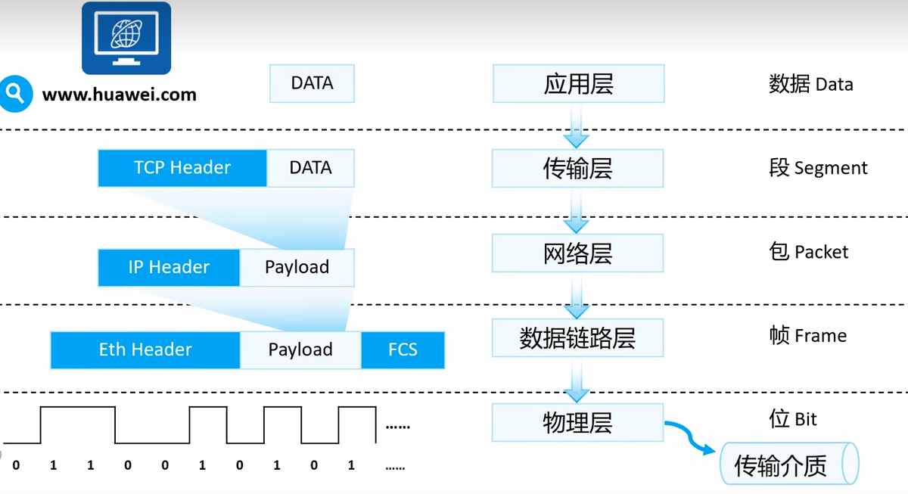

- 数据接收时，逐层向上，拆除相关头部或尾部的过程，称为解封装（拆包）

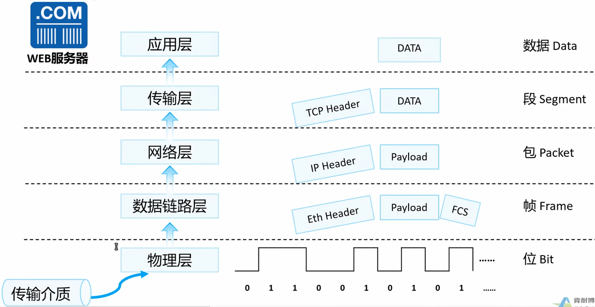

- OSI把每一层数据称为PDU（Protocol Data Unit，协议数据单元）
- TCP/IP根据不同层分别使用：数据（Data）、段（Segment）、包（Packet）、帧（Frame）、位（bit）

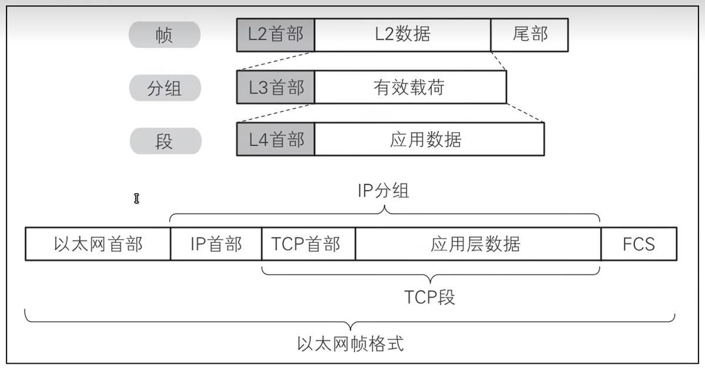

### Protocol：协议

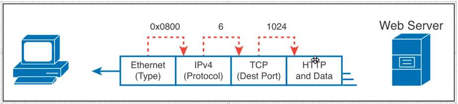

>在通信领域中，协议就是用来决定数据的格式和传输的一些规则
>
>网络通信中的“语言”

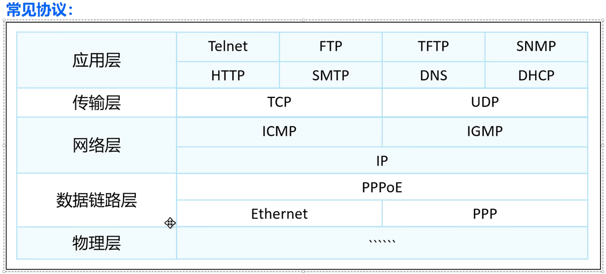

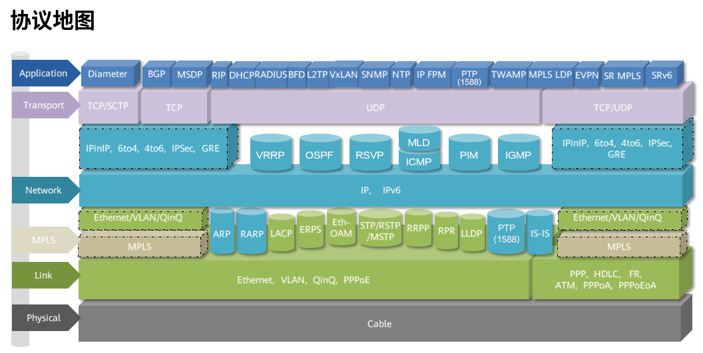

>【[华为官网公布的协议地图](https://support.huawei.com/hedex/hdx.do?docid=EDOC1000105967&id=ZH-CN_CONCEPT_0000001501534705)】

## 附录

### 参考文献

《[Wakin 谢Sir 最新数通精品课程_哔哩哔哩_bilibili](https://www.bilibili.com/video/BV1qP4y1w75v/?spm_id_from=333.999.0.0&vd_source=00d49c6b1d7b58728495868451fb3d19)》

### 版权信息

本文原载于 [Ranch's Blog](https://ranch007.github.io)，遵循 CC BY-NC-SA 4.0 协议，复制请保留原文出处。
