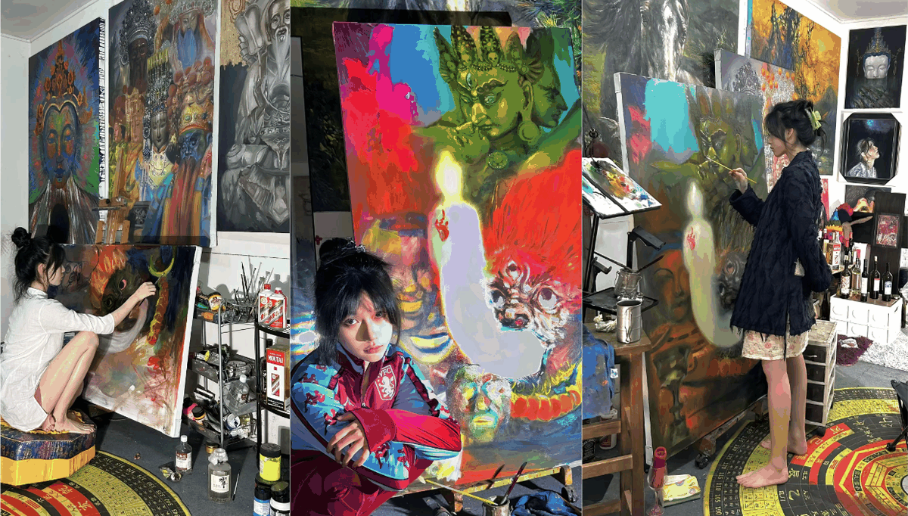

---

title: "有种一语惊醒梦中人的宿命感"
slug: "有种一语惊醒梦中人的宿命感"
description: 
date: "2024-11-11T18:30:21+08:00"
image: boss3332.png
math: 
license: 
hidden: false
draft: false 
categories: ["阅读随记"]
tags: [""]
---

---

> 
别人眼里的不是你

>
> 
你眼里的自己也不是你

>
> 
你眼里的别人才是你

>
> 
——— 萨特

回想之前的种种，我一直停留在“没准备好，光想不做”的阶段，虽然我很好地隐藏并克制了通过别人嘴里了解自己，但还是出现了自我矛盾与精神内耗，那些清醒与沉溺的对抗，让我的脑子开始不停地空转。

恰好那是一段独处的时间，我开始阅读，复盘生活中发生的事，琢磨里面的弯弯绕绕。一开始只是打发时间，想让脑子有个主题而不是瞎转，慢慢地，我喜欢上了这种第三方视角的感觉。

这种怪异的抽离感让我短暂摆脱内耗，但始终是治标不治本。

由于思想认知的不足，我没有方向。潜意识告诉我，要想改变，就要“知行合一”，可心境始终差那么一点意思。

在此之前，我不知道“内观”是什么，也不知道“内观”究竟意味着什么。

内观，我暂时的理解是一种自我反省，是一种深度审视自己内心的方式。它帮助我们剥离表象，直面内心深处的恐惧和不足。这个过程虽痛苦，但却是成长和自我提升的重要途径。

今天遇见这段话，给我一种点醒梦中人的宿命感。反复咀嚼这句话，我明白了，那些混沌感好像是在建立内观。就像剥洋葱一样，一层一层地剥开内心不敢直视的黑暗，不停地撕开自己的面具和遮羞布。原来这就是内观的过程，消除恐惧，承认不足，破而后立。

所以内耗，说到底，不是外界的东西在伤害你，而是你自己在伤害自己。通过内观进行主体性的建立，消除客体化，才能走出精神内耗。

通过投射效应，可以明白事实和看法是两码事，决定人心理状态的不是事实本身，而是对事实的看法。

一个很老的例子，桌上半瓶水是个事实，但同一个事实会产生悲观和乐观两种人，这就是由人们的看法决定的。

任何一件事永远可以从乐观的积极的方面去看待，这就叫成长型思维。建立主体性，用成长型思维看待生活，才会一路开挂下去。

## 附录

### 参考文献

《[写的内容越来越长了，素材都无关紧要的拼着看吧#画室日常 #油画 #内耗 ](https://www.douyin.com/video/7435588332970642703)》

### 版权信息

本文原载于 [Ranch's Blog](https://ranch007.github.io)，遵循 CC BY-NC-SA 4.0 协议，复制请保留原文出处。
