---

title: "GNS3懒人版-2.2.45安装部署详细教程"
slug: "GNS3懒人版-2.2.45安装部署详细教程"
description: 
date: "2024-11-12T23:01:09+08:00"
image: gns3.png
math: 
license: 
hidden: false
draft: false 
categories: ["网工笔记"]
tags: ["GNS3"]

---

---

## 前言

> 【[GNS3懒人版-2.2.45](https://www.emulatedlab.com/thread-1561-1-1.html)】—— by 熄灭的蜡烛
>
> 【[GNS3懒人版入门视频教程](https://www.bilibili.com/video/BV1fi4y1r7Tb/)】—— by 熄灭的蜡烛
>
> 感谢大佬的辛勤创作和无私分享！🫶

## 镜像集成列表

|        镜像        |                                                              |
| :----------------: | :----------------------------------------------------------- |
|   Cisco  | 1: Cisco IOL Router 15.7(3)M2 2: Cisco IOL Switch 15.2(CML_NIGHTLY_20180510) 3: Cisco IOL Switch 15.2(CML_NIGHTLY_20190423) 4: Cisco IOSv 15.9(3)M6 5: Cisco IOSvL2 15.2(20200924:215240) |
|      H3C      | 6: H3C vAC1000 7.1.064 R5466P01 7: H3C vFW1000 7.1.064 E1190P02 8: H3C vSR1000 7.1.064 R1362P12 |
|     HillStone      | 9: HillStone SG6000 CloudEdge 5.5R10P4 v6                    |
|     FortiGate      | 10: FortiGate 7.0.13                                         |
|   HuaWei | 11: HuaWei AR1kv V300R021C00SPC100T 12: HuaWei CE6800 V200R005C10SPC607B607 13: HuaWei CE12800 V200R005C10SPC607B607 14: HuaWei NE40E V800R011C00SPC607B607 15: HuaWei USG6000V2 V500R005C00SPC100 |
|     Ruijie    | 16: Ruijie RG NSE router v1.06 17: Ruijie RG NSE switch v1.06 18: Ruijie RG NSE firewall v1.03 |
|      Juniper       | 19: Juniper vMX vCP 23.2R1-S1.6 20: Juniper vMX vFP 23.2R1-S1.6-KVM |
|    Windows    | 21: Windows XP Pro SP3 x86 22: Windows Server 2022 DC x64 23: Windows 10 22H2 Pro for Workstation x64 24: Windows 11 23H2 Pro for Workstation x64 |
|     Ubuntu    | 25: Ubuntu Docker Guest 26: Ubuntu 22.04 Desktop amd64 27: Ubuntu Cloud 20.04 Server 28: Ubuntu Cloud 22.04 Server |
|      RHEL     | 29: RHEL 7.9 update 12 30: RHEL 8.8 31: RHEL 9.3     |

### 关于镜像密码的查看

在左侧设备列表里面双击你想要查看密码的那个，然后在打开的窗口里面点击最右边的选项卡里面查看。

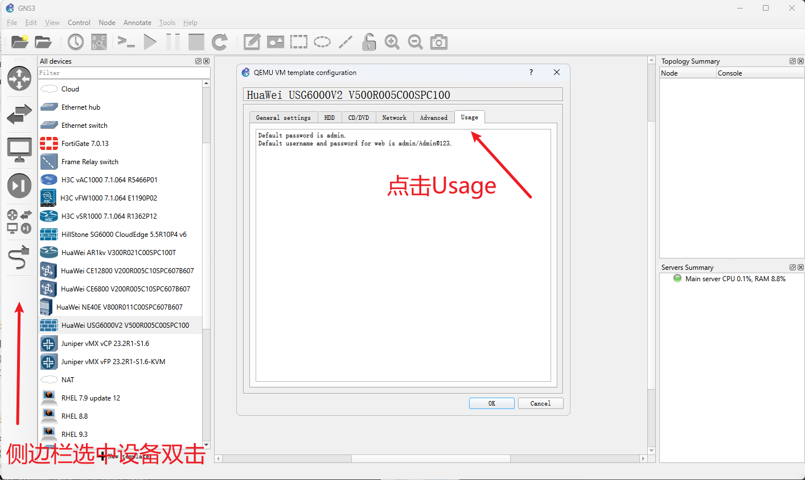

## 资源链接

>**百度网盘** 
>链接: https://pan.baidu.com/s/19aqOB7iBvXN9olJDZKwkjg?pwd=qpk3
>
>**123云盘** 
>链接: https://www.123pan.com/s/QCF9-8yWTd.html 
>提取码：DrnB
>
>**OneDrive商业版** 
>链接：https://xmdlz-my.sharepoint.com/:f:/p/xmdlz_vip/Es7y5_IPGR9PuhMXZoYKT-gBbDXt7Yo_voEEYFCBznCutw?e=Sw1YQ8 
>密码：TjptvEgWRyZidYgjCZw0

### 文件信息

文件名：GNS3.VM.VMware.Workstation.2.2.45.ova
大小：57572920832字节
MD5: 20c6aa8778ef84c08b5f9857469ac896
SHA1: a67e4a41acdec8802307dfa0490c5a1adf447db2
SHA256: 70bb6c738570ca6db011c003938cd8cde6ccf8ad11a48493c587234218307c2e

## 使用VMware导入GNS3 VM

### 下载GNS3懒人版

这里我使用的是作者提供的百度网盘中的链接

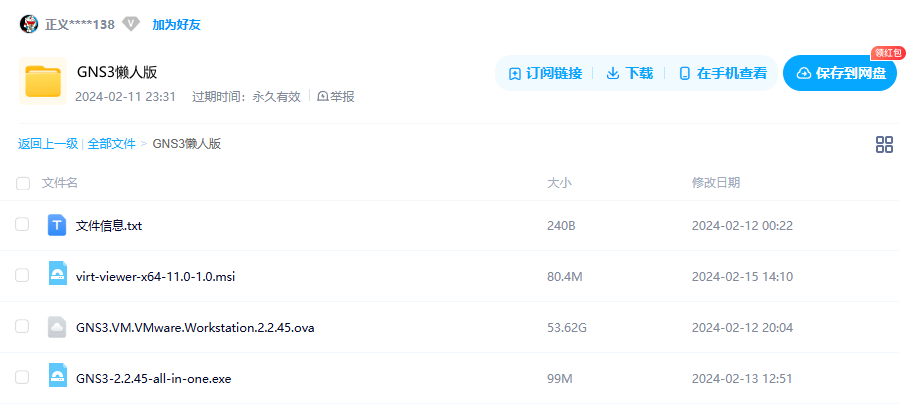

### 导入`GNS3 VM`

前提是得装好`VMwate Workstation Pro`，直接双击打开`GNS3.VM.VMware.Workstation.2.2.45.ova`

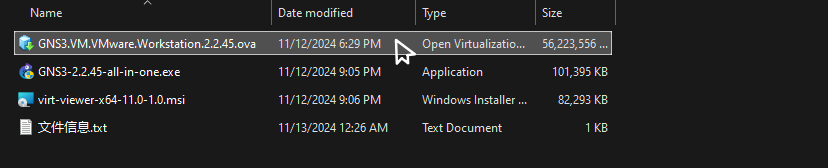

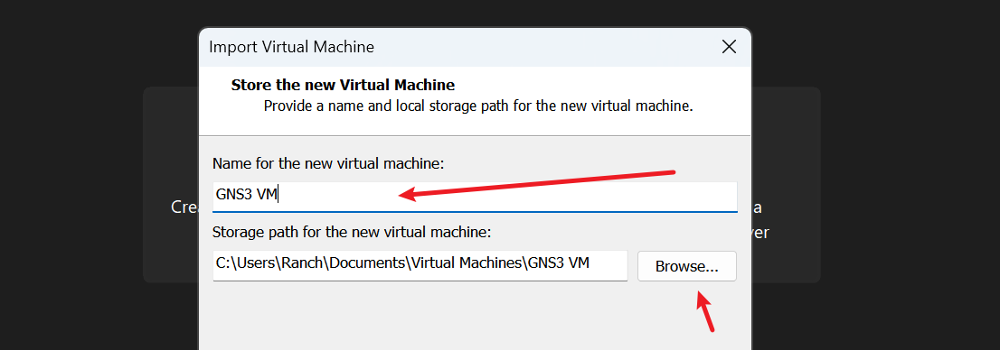

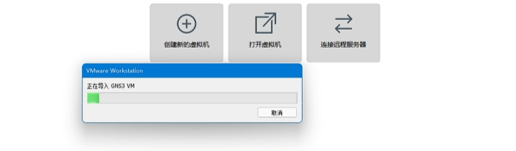

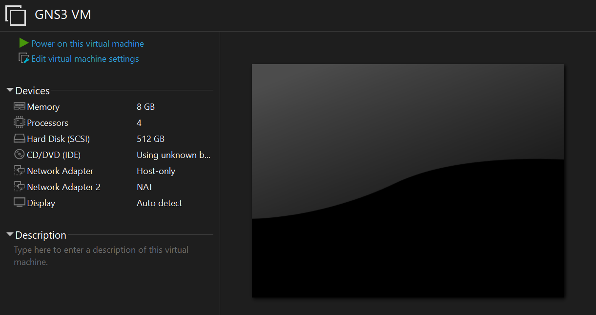

### 打开GNS3 VM

如果虚拟机正常开启并获取到IP，请保持打开状态继续下一步操作。

⚠️这里可能存在导入成功后，打开GNS3 VM获取不到IP地址。可能是`VMware DHCP Service`服务没有打开

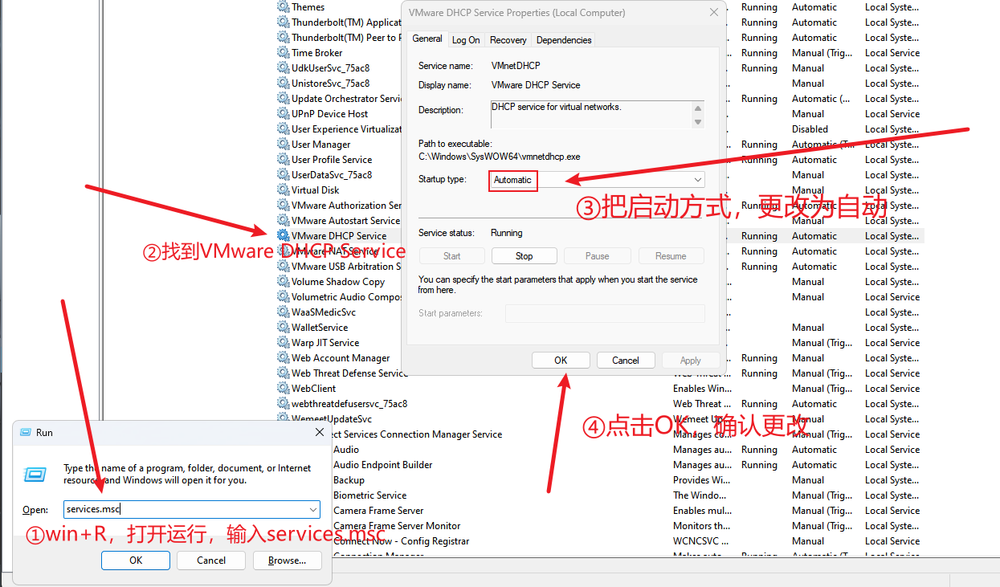

## 安装`GNS3-2.2.45-all-in-one.exe`

### 准备工作

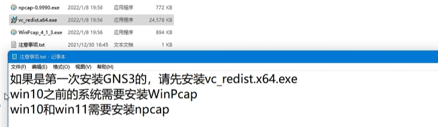

### 双击安装

无特殊需求，即可按照默认配置依序安装。

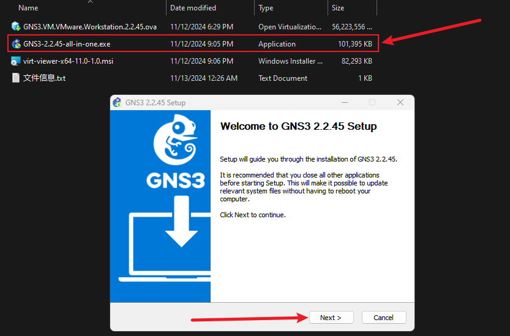

安装完成后打开GNS3

虚拟机GNS3 VM与GNS3版本必须保持一致，此教程使用`GNS3-2.2.45`

根据`Setup Wizard`提示，选择第三个，点击下一步

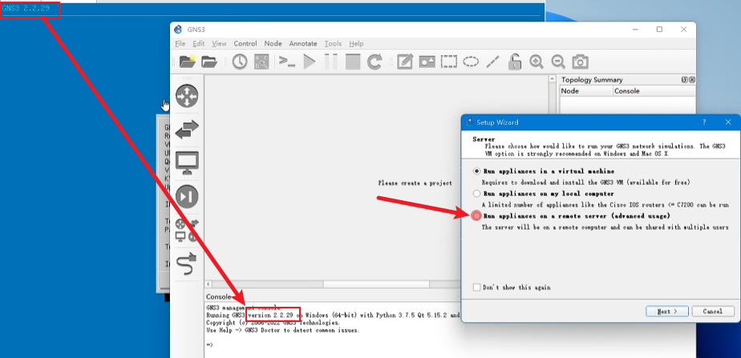

将虚拟机中获取的IP地址和端口号，依次输入。并取消`Enable authentication`的勾选。

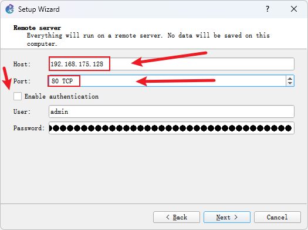

稍等一会就会出现这个，点击下面的Finish就完成了

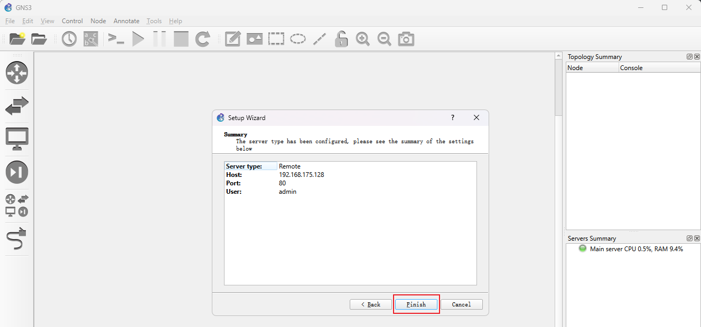

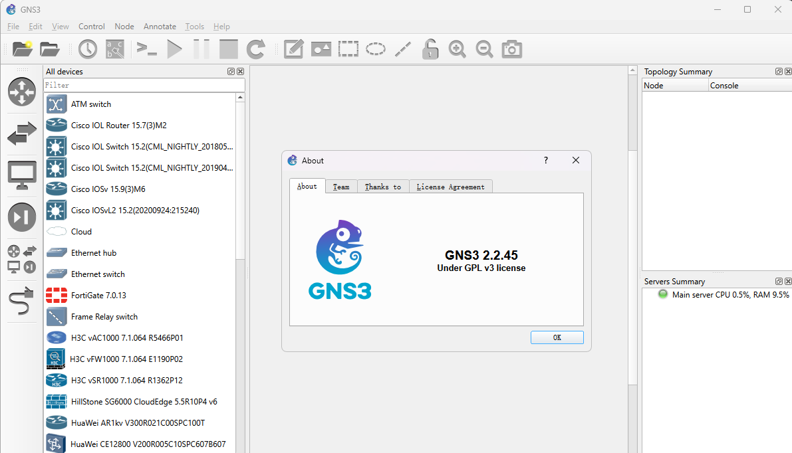

再次感谢“熄灭的蜡烛”大大的制作与分享，让我们用上集成般的GNS3！👏

## 附录

### 参考文献

《[GNS3懒人版-2.2.45](https://www.emulatedlab.com/thread-1561-1-1.html)》

《[GNS3懒人版入门视频教程](https://www.bilibili.com/video/BV1fi4y1r7Tb/)》

### 版权信息

本文原载于 [Ranch's Blog](https://ranch007.github.io)，遵循 CC BY-NC-SA 4.0 协议，复制请保留原文出处。
