---

title: "APP抓包之 Burpsuite+MuMu模拟器12抓包"
slug: "APP抓包之 Burpsuite+MuMu模拟器12抓包"
description: 
date: "2024-11-19T12:32:00+08:00"
image: bp+mumu.png
math: 
license: 
hidden: false
draft: false 
categories: ["网安笔记"]
tags: ["环境"]

---

---

## 环境准备

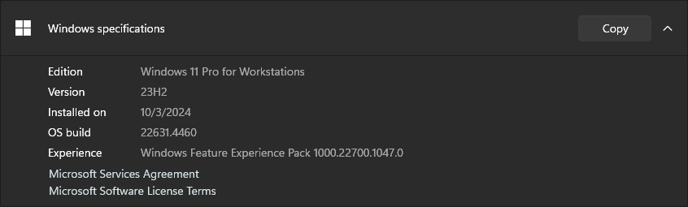

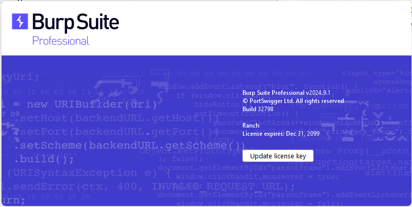

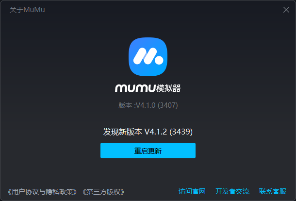


### 调试工具

> [ADB 是 Android SDK 中的一个工具，可以直接操作管理 Android 模拟器或者真实的 Android 设备。](https://blog.csdn.net/x2584179909/article/details/108319973)
>
> [OpenSSL是一个功能丰富且开源的安全工具箱。](https://blog.csdn.net/zyhse/article/details/108186278)

#### 检查 adb

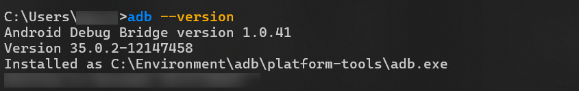

#### 检查 OpenSSL


## 下载证书

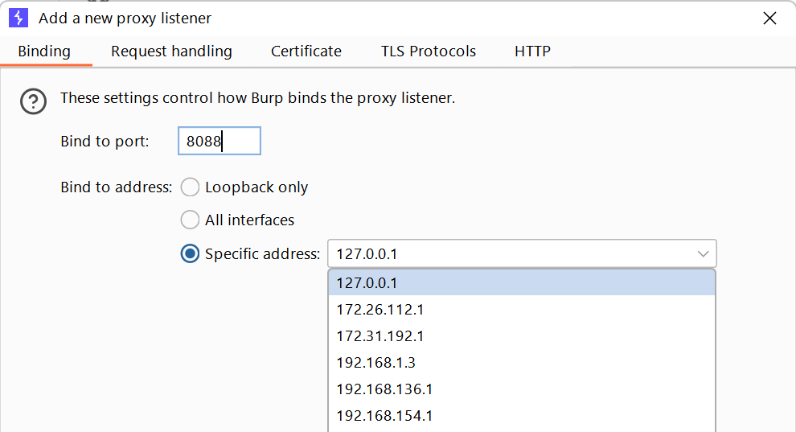

- 访问你的IP+端口即`ip:8088`导出CA证书，点击右上角下载

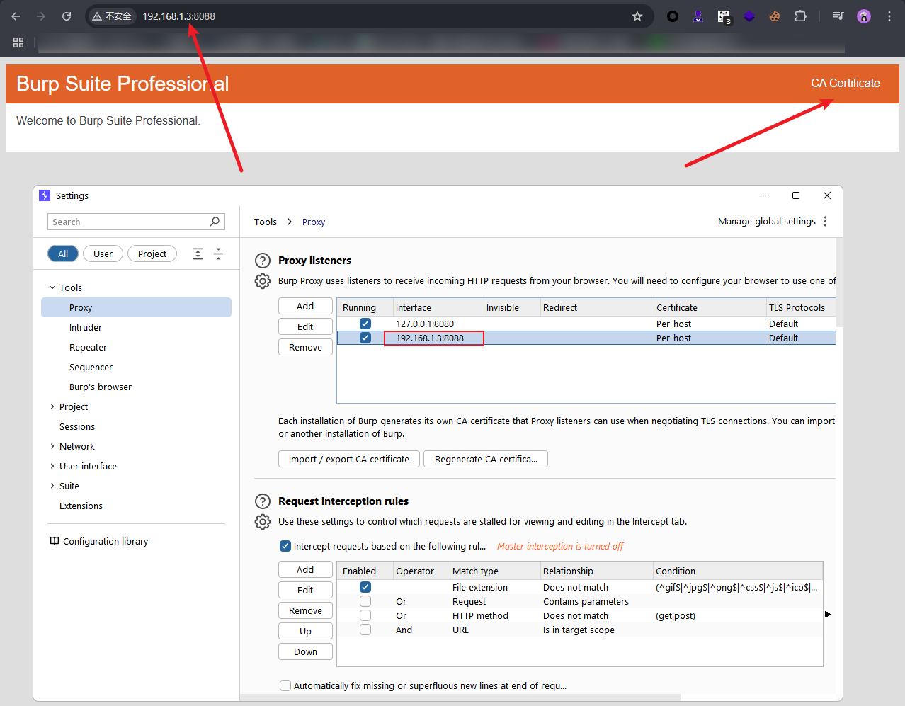

## 进行调试

### 重命名证书

在保存ca证书的文件夹右键打开终端或者箭头导航栏输入`cmd`，并输入以下命令：

```cmd
　openssl x509 -subject_hash_old -in {证书全名带后缀}
```

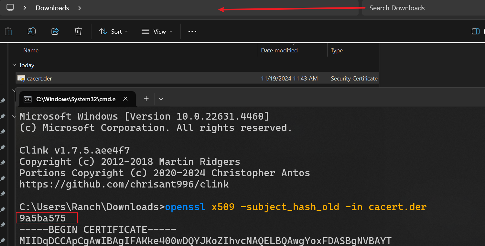

生成一串字符串，复制红框保存下来，并把证书名字改为这个，后缀改为0，如下所示：

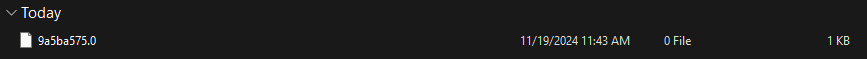

### 配置MuMu模拟器

- 打开磁盘可写以及Root权限，重启模拟器

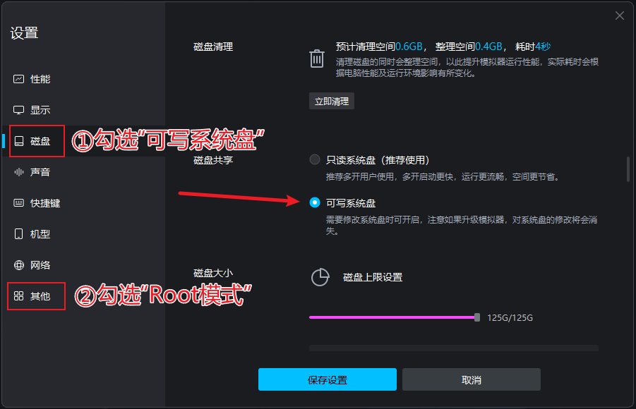

- 找到 adb 调试端口

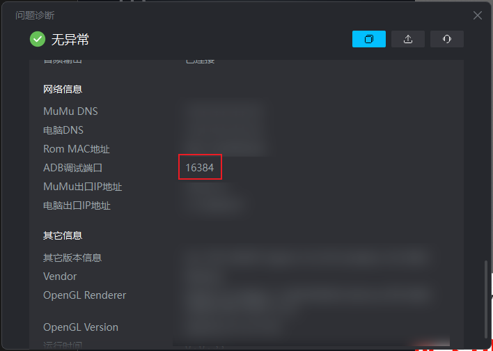

### 使用 adb 连接模拟器

```
adb devices：查看当前连接的设备，已连接的设备会显示出来
adb connect：连接adb调试端口
adb push <本地路径\文件或文件夹> <手机端路径>：把本地(pc机)的文件或文件夹复制到设备(手机)
adb shell：登录设备 shell，该命令将登录设备的shell（内核），登录shell后，可以使用 cd，ls，rm 等Linux命令
su：提升为root权限（linux命令）
```

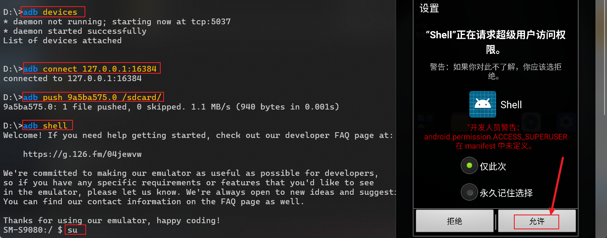

- 使用`cd /sdcard/;ls`命令，查看刚刚上传的

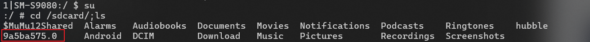

- 将该文件移动到`/system/etc/security/cacerts/`目录下


- 进入`/system/etc/security/cacerts/`目录，查看文件是否移动成功；并进行赋权和更改用户组。

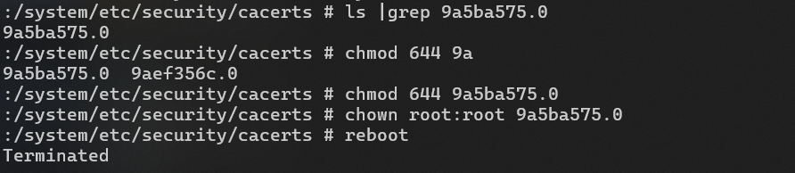

- 重新启动MuMu模拟器，配置网络代理，访问浏览器

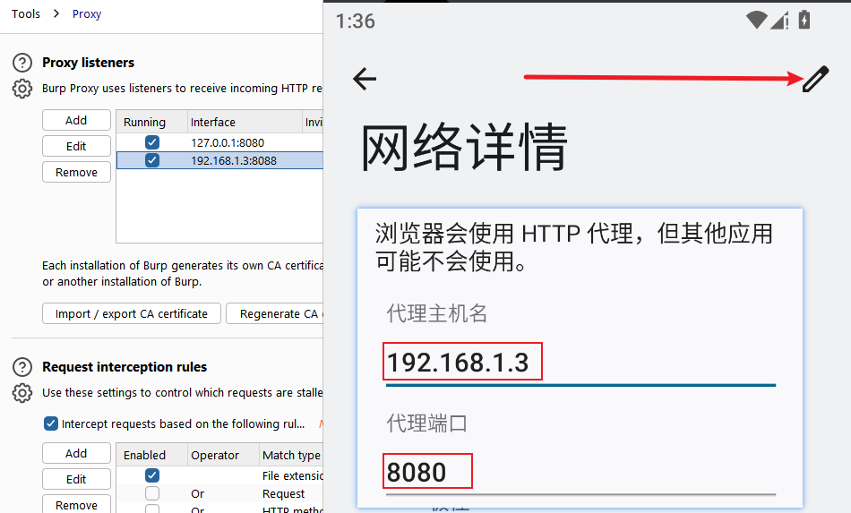

## 尝试抓包

证书安装完成，此时抓包不再显示证书无效

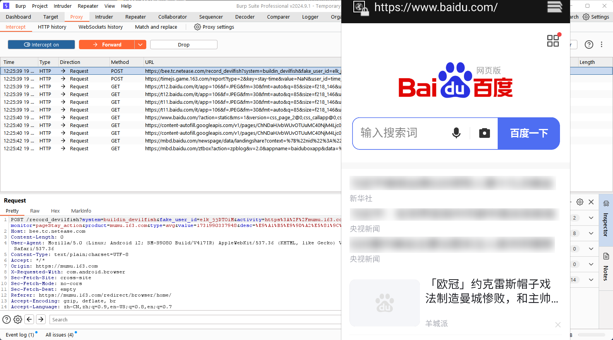

## 附录

### 参考文献

- 《[APP抓包之 Burpsuite+MuMu模拟器12抓包_mumu模拟器安装burp证书-CSDN博客](https://blog.csdn.net/weixin_73399382/article/details/140844698)》
- 《[windows下载安装adb（极其简单）_adb工具下载windows-CSDN博客](https://blog.csdn.net/x2584179909/article/details/108319973)》
- 《[环境篇-Windows下安装OpenSSL_opensslwin64下哪个-CSDN博客](https://blog.csdn.net/zyhse/article/details/108186278)》
- 《[ADB安装及使用详解（非常详细）从零基础入门到精通，看完这一篇就够了__adb工具-CSDN博客](https://blog.csdn.net/ZL_1618/article/details/132356781?ops_request_misc=%7B%22request%5Fid%22%3A%228766e0ec2d01b6e83232eb11d4a10602%22%2C%22scm%22%3A%2220140713.130102334..%22%7D&request_id=8766e0ec2d01b6e83232eb11d4a10602&biz_id=0&utm_medium=distribute.pc_search_result.none-task-blog-2~all~top_positive~default-1-132356781-null-null.142^v100^pc_search_result_base3&utm_term=adb&spm=1018.2226.3001.4187)》

### 版权信息

本文原载于 [Ranch's Blog](https://ranch007.github.io)，遵循 CC BY-NC-SA 4.0 协议，复制请保留原文出处。
